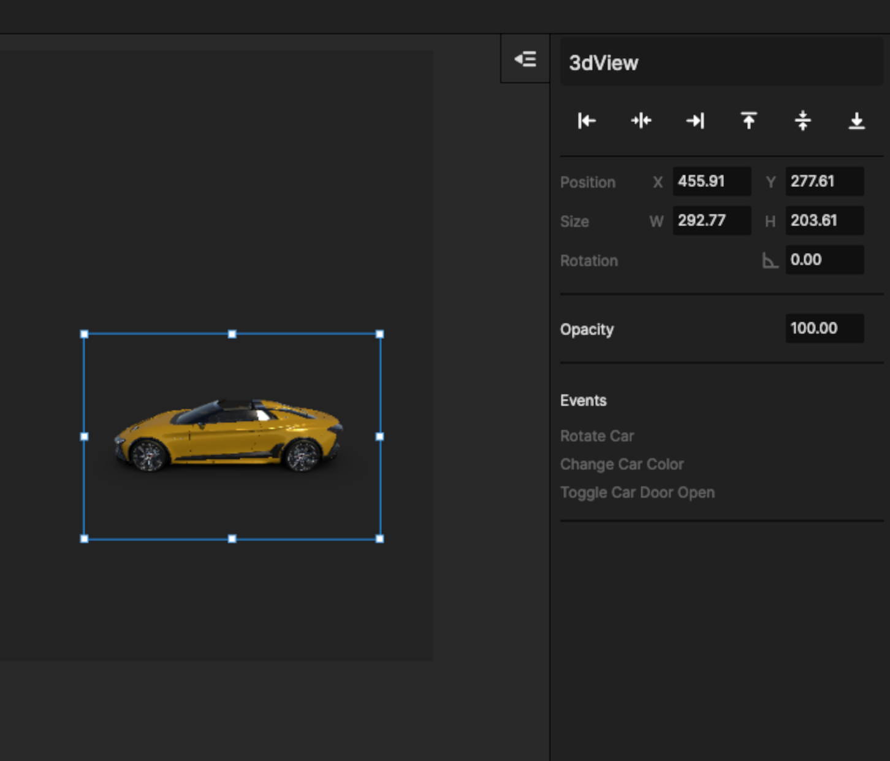

# 2.1 车辆

车辆类型的元件有可以支持的Event如图所示\
这些 Events 支持被增加 Trigger  并执行 [Action- AutoRun](../../jiao-hu-bian-ji/3.-dong-zuo-fan-kui-action/3.7-zi-dong-yun-hang-autorun-ding-zhi-gong-neng.md)

<figure><figcaption></figcaption></figure>

## Event 说明：

* rotate：3D旋转
* change colour： 车模变色
* Door open ：开车门

