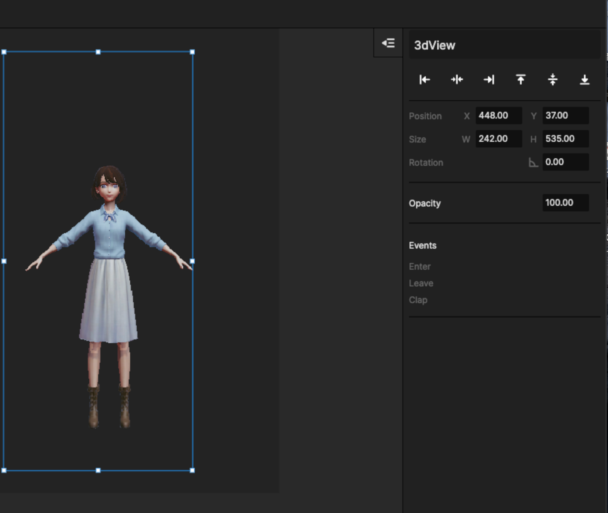

# 2.2 人物形象

车辆类型的元件有可以支持的Event如图所示\
这些 Event 支持被增加 Trigger 或者 [Action- AutoRun](../../jiao-hu-bian-ji/3.-dong-zuo-fan-kui-action/3.7-zi-dong-yun-hang-autorun-ding-zhi-gong-neng.md)

<figure><figcaption></figcaption></figure>

## Event 说明：

* Clap：人物拍手动作
* Enter： 人物入场动效
* Leave ：人物离场动效

