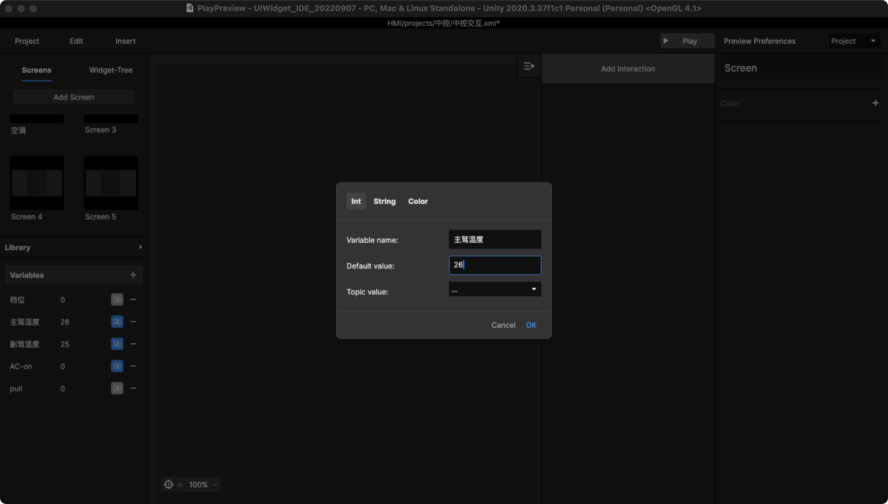

# 1. 变量

* 从左侧的变量面板中新建变量值，此变量通用于整个  Project 。

* 点击新增后出现弹窗

* 分别有3个类型的变量可以进行设置：\
  【 Int 】指数值，可以进行公式运算，具体可以查看[变量使用案例](../jin-jie-jiao-cheng/3.-bian-liang-shi-yong-an-li.md)\
  【 Sting 】指字符串，可以进行文字引用等\
  【 colour 】指可变的颜色设置，可用于背景色

* Topic Value 也支持 监听功能（预定义变量值）\
  当 Text 元件图层设置了变量，则可以支持直接监听 Topic 内容，显示预设的 Topic 信息。

已设置好的变量会显示在下方，点击名称可以修改：

.png>)

<figure><figcaption>
展开变量编辑弹窗
</figcaption></figure>

