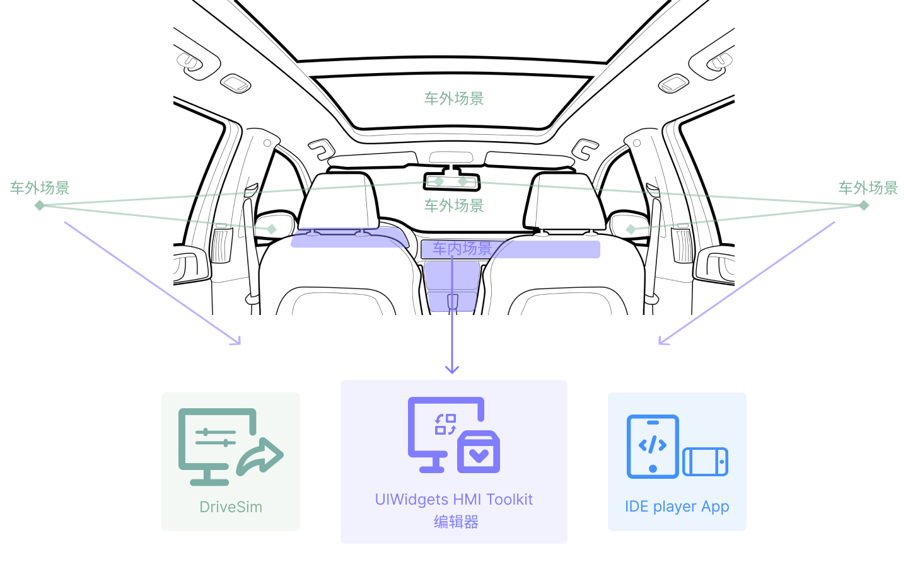

# 2. UIWidgets HMI Toolkit 生态系统

整套 UIWidgets HMI Toolkit 生态系统主力打造 车载 HMI 的完整场景模拟，由 Drive Sim 设置车外场景，由 UIWidgets HMI Toolkit 编辑器编辑车内的创意原型，并通过安装IDE player App 模拟在移动端设备，达到创意的模拟。

UIWidgets HMI Toolkit 编辑器作为整套产品生态的核心，主要进行 车载HMI 界面的编辑。

