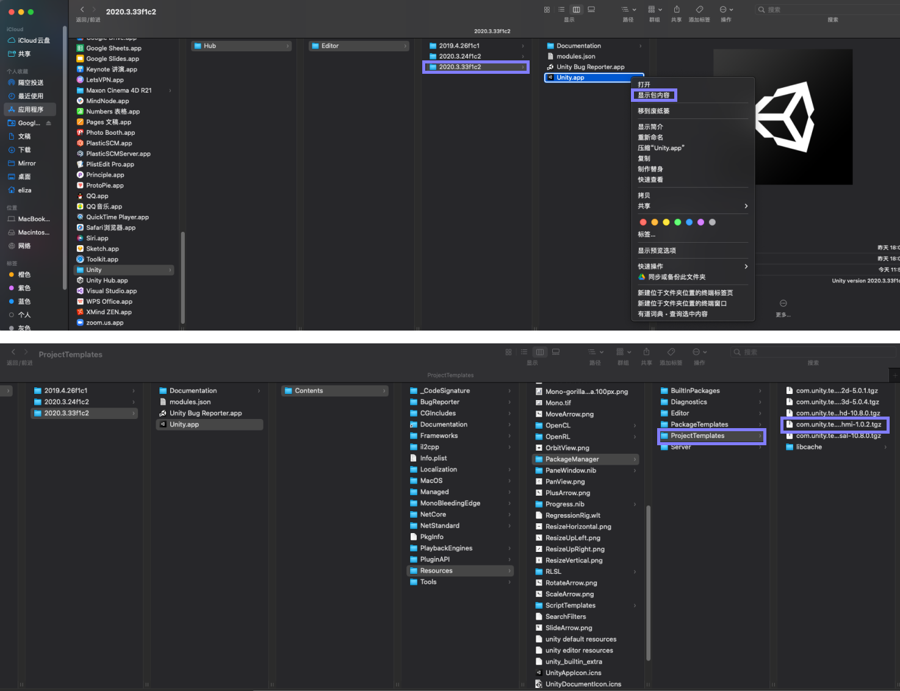
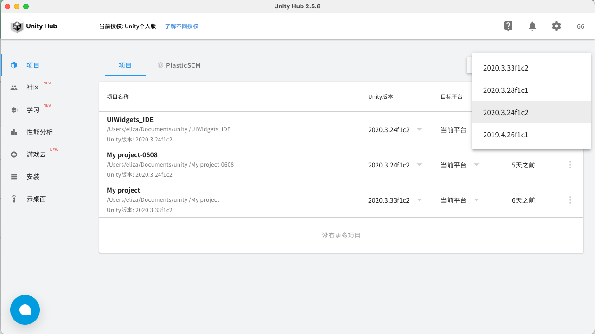

# 【mac版】 安装教程

【iOS系统】想要使用 UIWidgets HMI Toolkit ，步骤如下：

### 1、下载 [Untiy Hub](https://unity.cn/releases)，建议使用2.5，如下图所示：

#### 安装后，注册账号（需要有license，可以先使用个人版），打开界面如下：

.png>)

### 2、安装 unity 编辑器，方法如下：

.png>)

先切换到【安装】目录，看到弹窗，选择【[官方发布网站](https://unity.cn/releases)】：

.png>)

点击【[官方发布网站](https://unity.cn/releases)】再次进入unity官方下载页面：

.png>)

选择【unity2020.x】下，2020的3.24之后的版本（暂不支持m1芯片的版本），然后按【从Hub下载】绿色按钮，出行系统下载跳转弹窗：

.png>)

点击从 unity hub 打开，出现下图弹窗，下载确认弹窗，确认是否已经勾选了“Document”，确认后点击【install】随即下载，如下图所示：

.png>)

务必勾选此选项，勾选后点击【安装】按钮，可以看到下载进程，等待下载完成

.png>)

### 3、下载 Unity [模板包](https://drive.google.com/drive/folders/1sKB-mvcUoThl2Di-l2LvmtJ6KUUuakVI)，请勿解压，如下操作进行安装：

如下图所示mac系统中，依次打开路径（其中假设2020.3.33f1c2为上一步下载的unity编辑器名称，实际按你下载的文件即可）：Applications/Unity/Hub/Editor/2020.3.33f1c2/Unity/Contents/Resources/PackageManager/ProjectTemplates

将已下载的 [模板包](https://drive.google.com/drive/folders/1sKB-mvcUoThl2Di-l2LvmtJ6KUUuakVI)（未解压，文件名为 **tgz** 为结尾），直接复制或移动到该位置：

安装后，重启 Unity Hub。（一定要重启才可以进行下一步）

在【项目】中点击【新项目】，出现目前的新项目的设置：

.png>)

选择 HMI Toolkit Template，并设置项目名称和路径，确认后点击【创建项目】，程序即开始创建。

如果没有找到 HMI Toolkit Template，请查看新建的版本，点击新建右边的三角符号，选择版本，如下图所示：

### 4.开始使用【 UIWidgets HMI Toolkit】

上一步操作，创建后，点击该 Project 项目文件，等待程序打开：

.png>)

启动过程中会出现如下情况，为防止误操作，请同步打开【系统偏好设置】-【安全性与隐私】：\
（不要“移到废纸篓”，点击“取消”后，系统偏好设置会出现可以点击的信息）

.png>)

如图所示，点击【仍然允许】-【打开】后，开启unity编辑之旅，完成上述进程后，打开界面如下：

.png>)

在系统导航栏找到【HMI】后打开：

.png>)

加载完成，进入 UIWidgets HMI Toolkit ：

.png>)

