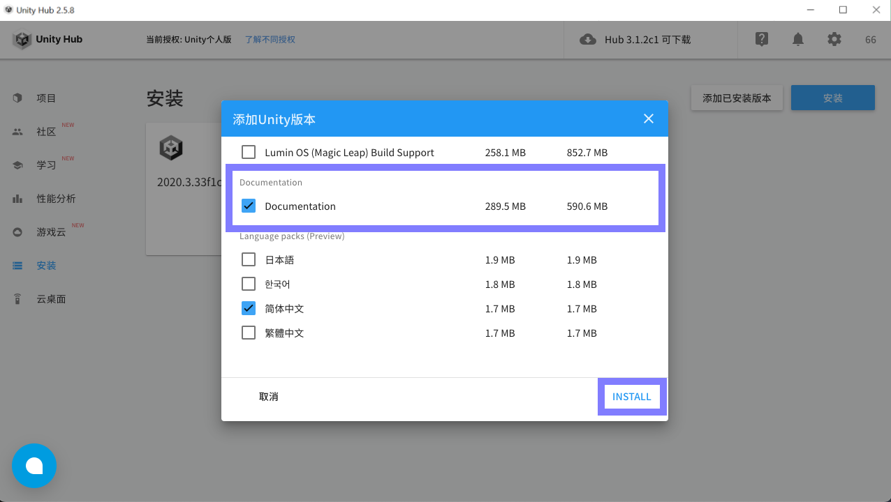
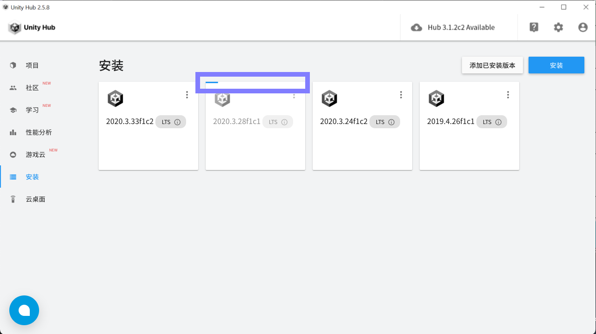
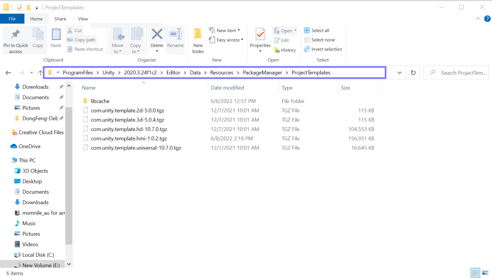
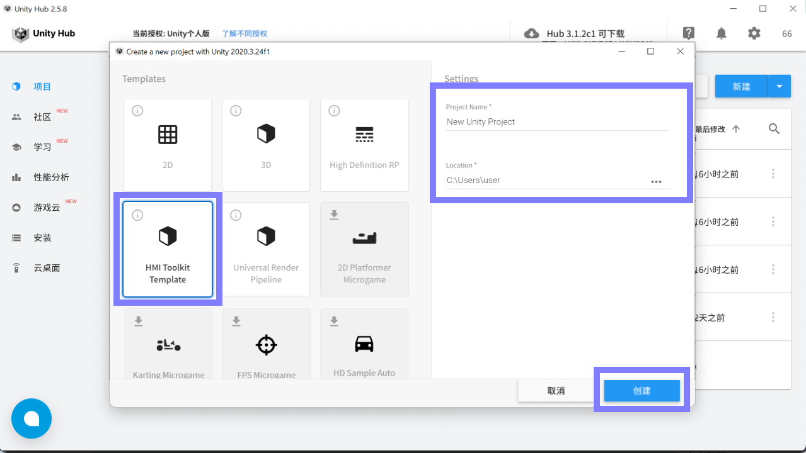
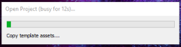
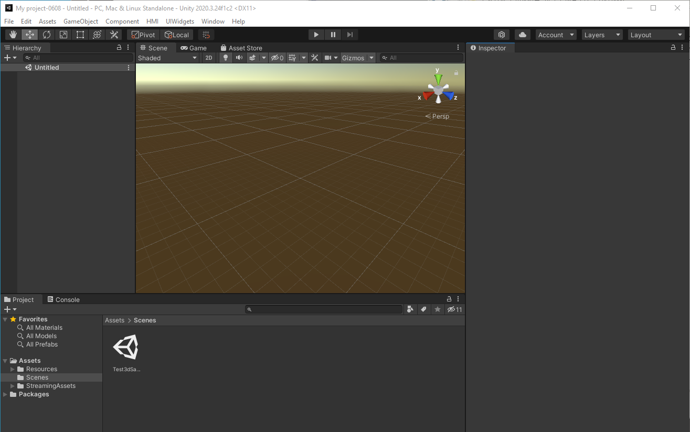
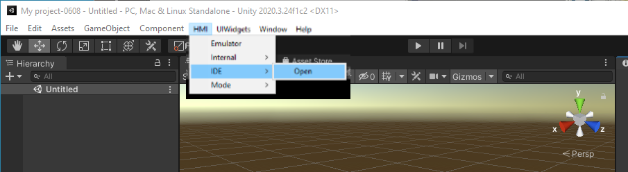

# 【Windows版】 安装教程

【Windows系统】想要使用 UIWidgets HMI Toolkit ，步骤如下：

### 1、下载 [Untiy Hub](https://unity.cn/releases)，建议使用2.5，如下图所示：

#### 安装后，注册账号（需要有license，可以先使用个人版），打开界面如下：

.png>)

### 2、安装 unity 编辑器，方法如下：

.png>)

先切换到【安装】目录，再点击【安装】按钮，看到弹窗，点击【[官方发布网站](https://unity.cn/releases)】：

.png>)

点击【[官方发布网站](https://unity.cn/releases)】再次进入unity官方下载页面：

.png>)

选择【unity2020.x】下，2020的3.24之后的版本（暂不支持m1芯片的版本），然后按【从Hub下载】绿色按钮，出现系统下载跳转弹窗：

点击从 unity hub 打开，出现下图弹窗，下载确认弹窗，确认是否已经勾选了“Document”，确认后点击【install】随即下载，如下图所示：

务必勾选此选项，勾选后点击【安装】按钮，可以看到下载进程，等待下载完成

### 3、下载 Unity [模板包](https://drive.google.com/drive/folders/1sKB-mvcUoThl2Di-l2LvmtJ6KUUuakVI)，请勿解压，如下操作进行安装：

已收到下载包用户不需要单独下载，在打包文件夹中选择对应的文件类型即可，未下载个人用户需要额外申请。\
如下图所示mac系统中，依次打开路径（其中假设2020.3.24f1c2为上一步下载的unity编辑器名称，实际按你下载的文件即可）：

**C:\ Program Files\Unity\Hub\Editor\2020.3.24f1c2\Editor\Data\Resources\PackageManager\ProjectTemplates**

将已下载的 [模板包](https://drive.google.com/drive/folders/1sKB-mvcUoThl2Di-l2LvmtJ6KUUuakVI)（未解压，文件名为 **tgz** 为结尾），直接复制或移动到该位置：

安装后，重启 Unity Hub。（一定要重启才可以进行下一步）

在【项目】中点击【新建】，出现目前的新项目的设置：

选择 HMI Toolkit Template，并设置项目名称和路径，确认后点击【创建项目】，程序即开始创建。

如果没有找到 HMI Toolkit Template，请查看新建的版本，点击新建右边的三角符号，选择版本，如下图所示：

.png>)

### 4.开始使用【 UIWidgets HMI Toolkit】

上一步操作完成后，再在hub中点击该 Project 项目文件，等待程序打开：

完成上述进程后，打开界面如下

在系统导航栏找到【HMI】后打开：

加载完成，进入 UIWidgets HMI Toolkit ：

