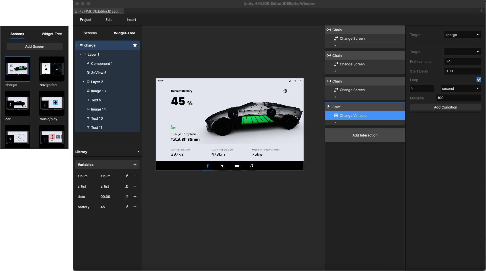

# 4. 了解用户界面


[4.-uiwidgets-jie-mian.md](../ji-chu-jiao-cheng/4.-uiwidgets-jie-mian.md)


打开 UIWidgets HMI Toolkit后，用户界面可以分为以下组成部分：

<figure><figcaption></figcaption></figure>

1、工具栏

2、侧边栏界面视窗/图层

3、扩展资源库

4、变量

5、中央画布

6、交互列表、属性与配置信息

## 1、工具栏：

分Project、Edit、Insert三大板块，点开如下图所示：

<figure><figcaption></figcaption></figure>

另外右侧包含了快速[预览](../ji-chu-gong-neng/5.-yu-lan-yan-shi-play.md)的工具。

## 2、侧边栏（左）——界面视窗/图层结构：

此区域分为两种状态。

当目前为界面视窗时，即本 Project 中所有的[界面场景](../ji-chu-gong-neng/2.-jie-mian-chang-jing-screen.md)。

同时分为选中的 Screen 和已创建的Screen，显示内容为 Screen的缩略图

当前中央画布所在的 Screen 为选中的 Screen，切换为图层结构时，显示当前Screen下的元件图层，具体使用逻辑可以查阅：[基础功能-3.树形结构](../ji-chu-gong-neng/3.-shu-xing-jie-gou-wiggettree.md) 。

## 3、侧边栏（左）——素材资源扩展库：

默认只显示素材扩展面板入口，点击后展开内容，包括了预设的常用组件、用户自定义组件、字体与3D模型。

<figure><figcaption></figcaption></figure>

可以通过 [组件使用案例](broken-reference) 来了解组件类型与使用规则；

可以通过 [3D 模型使用案例](broken-reference) 来了解 3D模型库规则。

## 4、侧边栏（左）——变量面板：

侧边栏的最下方区域可以增加交互变量。

具体使用在 [变量](../bian-liang-yu-biao-da-shi/1.-bian-liang.md) 中查看，也可以跨组件使用变量。

## 5、中央画布

在画布上，可以看到所有场景及当前场景上的元件图层。

可以使用多种方式在画布上插入不同的元件图层、组件、3D模型等，图层支持放大缩小。可以将图层中导入、或者直接创建图层。

## 6、交互列表与配置信息

1、在选中元件或控件的图层时，配置面板显示的是元件控件的基础属性。

具体每个元件有哪些属性，可以查看[元件图层](../ji-chu-gong-neng/4.-yuan-jian-tu-ceng-insert.md)、[组件库](../zu-jian/2.-kuo-zhan-zi-yuan-ku-chang-yong-zu-jian/)。

2、通过交互列表，可以创建[交互设计Interaction](../jiao-hu-bian-ji/1.-jiao-hu-she-ji-interaction.md)。

通过添加 [触发机制（trigger）](../jiao-hu-bian-ji/2.-chu-fa-ji-zhi-trigger/)将其连接到一个或多个 [动作反馈（Action）](../jiao-hu-bian-ji/3.-dong-zuo-fan-kui-action/) 上即可创建交互。

参考如下流程：

当在设置交互时，右侧的配置信息面板显示可编辑的参数信息，具体可以查看不同的交互的逻辑。

