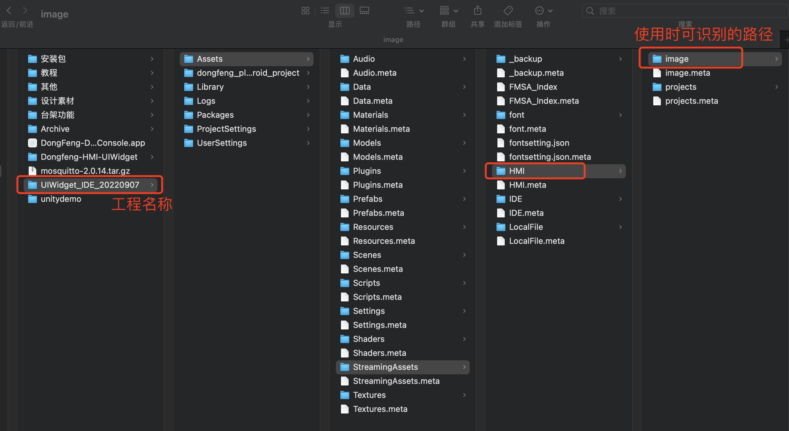
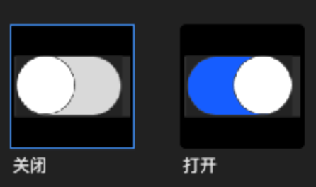
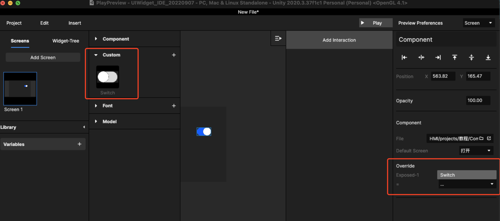

# 1. 如何做 Switch 控件？

## Step1、先切图

切图的内容放在工程文件夹的固定路径内。

<figure><figcaption></figcaption></figure>

## Step2、设置画板、导入UI素材

设置画板尺寸根据切图的尺寸设置画板尺寸：在当前素材中，Switch的尺寸是113\*64，可以微微大于元素设置为115\*66。

然后导入图片，可以insert image，也可以直接把文件夹里的图片拖入画布中。

## Step3、设计控件状态和切换关系

根据控件的状态，设置Screen的个数，几个状态几个Screen

<figure><figcaption>
Switch 分 “打开”、“关闭”两个状态
</figcaption></figure>

设计状态直接的跳转关系，当前案例中：

1、关闭下，向右 pull 圆点按钮，跳转到“打开”页\
2、打开时，向左 pull 圆点按钮，跳转到“关闭”页

另外可以增加快捷热区，比如说只要点击控件就可以切换状态。

另外状态的切换可能也可以附加函数，以便之后再次引用，可以设：\
进入关闭页时，函数为0；进入打开页时，函数为1

全部设计完毕后保存到Project的固定路径中，文件尾缀为：xml文件

<figure><figcaption></figcaption></figure>

## Step4：设置在自定义控件组中方便反复使用

重新建立一个新文件，然后再在扩展库中，导入当前控件，之后可以反复使用当前组件，也可以新增函数进行控件内容关联，如果Switch内容修改后，控件组内容同步修改，复用同一控件，都发生变化

<figure><figcaption></figcaption></figure>

以上流程和步骤可以参考视频：



