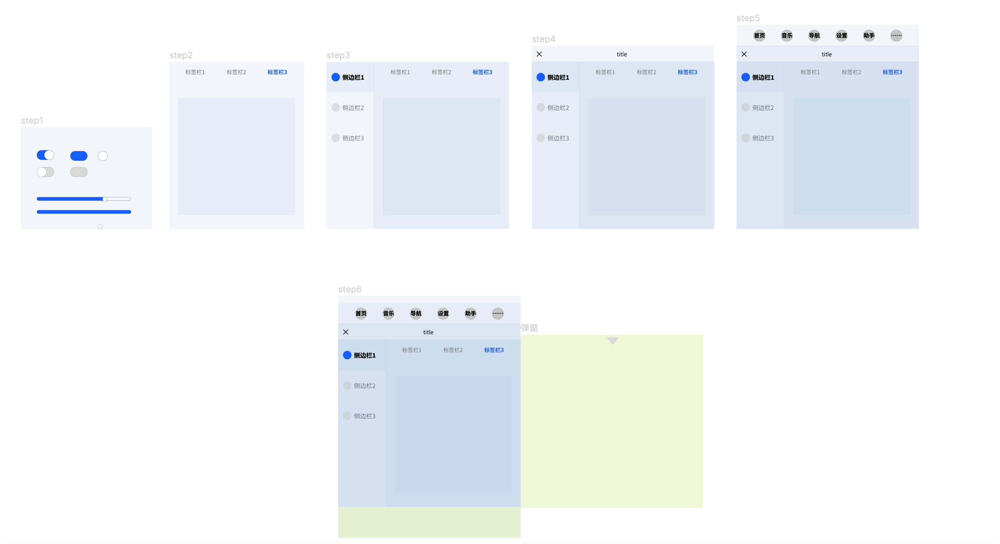

# 10. 合成完整的交互方案

整个交互页面合成其实就是把xml文件中加Component的过程，层层嵌套

<figure><figcaption>
多层级嵌套组合成完整的交互方案
</figcaption></figure>

交互关系也是从里到外，注意点有以下：

1、从小的组件开始制作

2、状态用screen区分

3、子Component的Variable暴露后Override可以层层使用

4、内部Component改动一次即可，外部层层引用最新文件

**5、最重要：引用路径在一个Project下不要随意更改文件夹路径**

****

前9个课程需要依次学习，整合前9课程内容可以参考下述视频：



