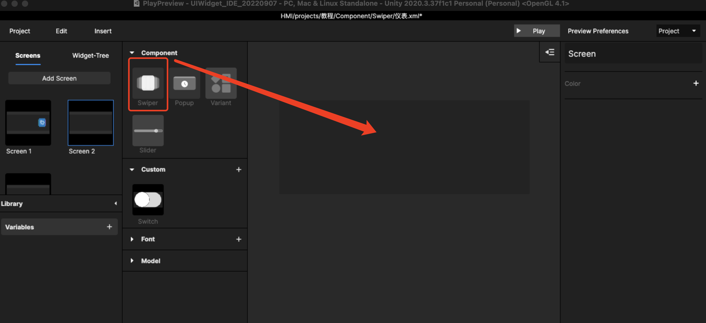
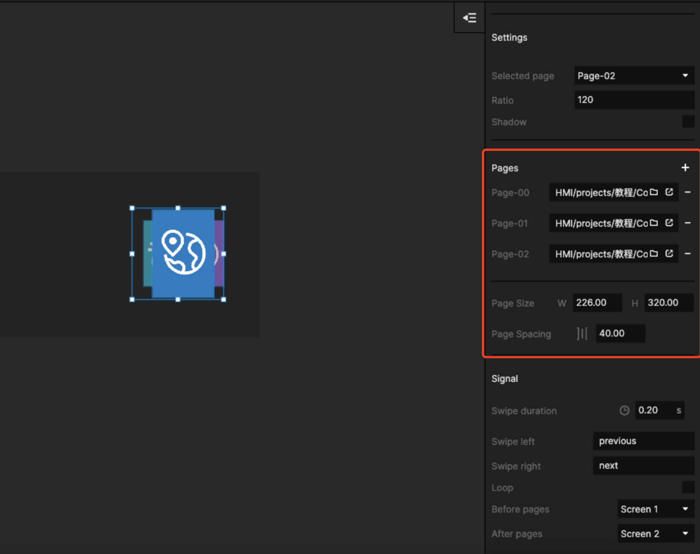
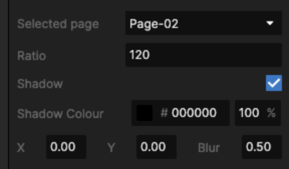
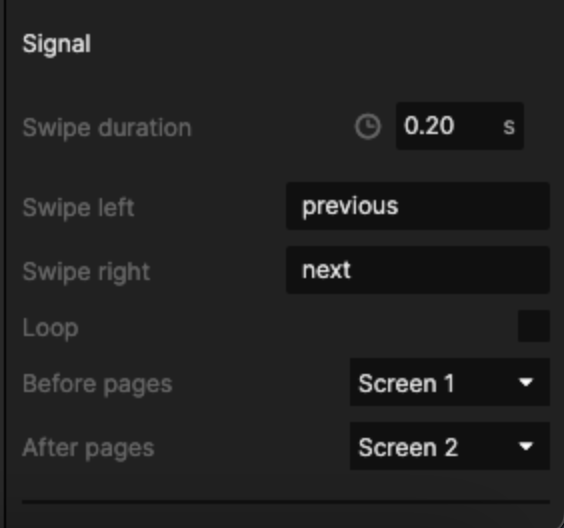

# 2. 如何做 Swiper 控件？

## Step1、先做Swiper内每个页面的内容

做内容时，多个Swiper内页尺寸要同一

<figure><figcaption>
记得这个尺寸，是后续的 page size
</figcaption></figure>

把所有的 Swiper page 都做完再做后续页面。

## Step2、建立需要引用Swiper的新画板

在library中把Swiper控件拖入画面

<figure><figcaption></figcaption></figure>

把第一步设计好的Swiper页面加进画面中，并设置画板中每个 Swiper page 的尺寸，如下图所示，此处的尺寸为上一个xml中Screen的尺寸

<figure><figcaption></figcaption></figure>

## Step3、预览效果，设置Swiper整体的尺寸和效果

去预览，然后确定被选中的中间的页面比例，多个页面直接的间隔比例

<figure><figcaption>
选中的“C位”页面可以特殊处理
</figcaption></figure>

然后设置高级的功能，滑动时长、是否需要loop、滑动到第一个页面或最后一个页面是否有跳转等

<figure><figcaption></figcaption></figure>

## Step4：保存当前文件

调试和编辑后保存当前文件。

如果每个Swiper 页面改动后，当前文件自动改动。

以上流程和步骤可以参考视频：



