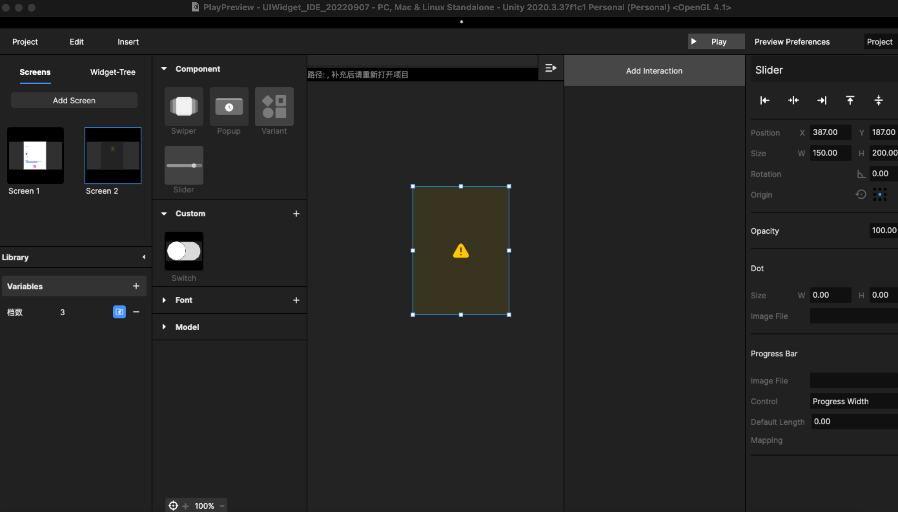
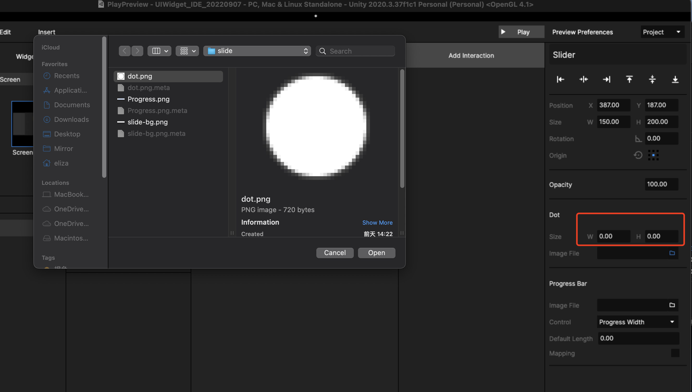
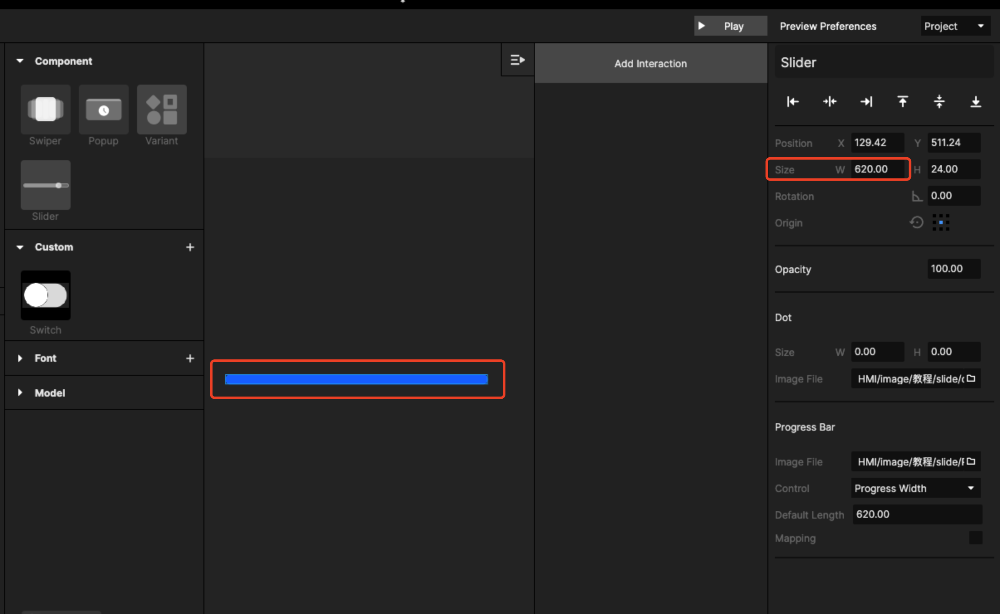
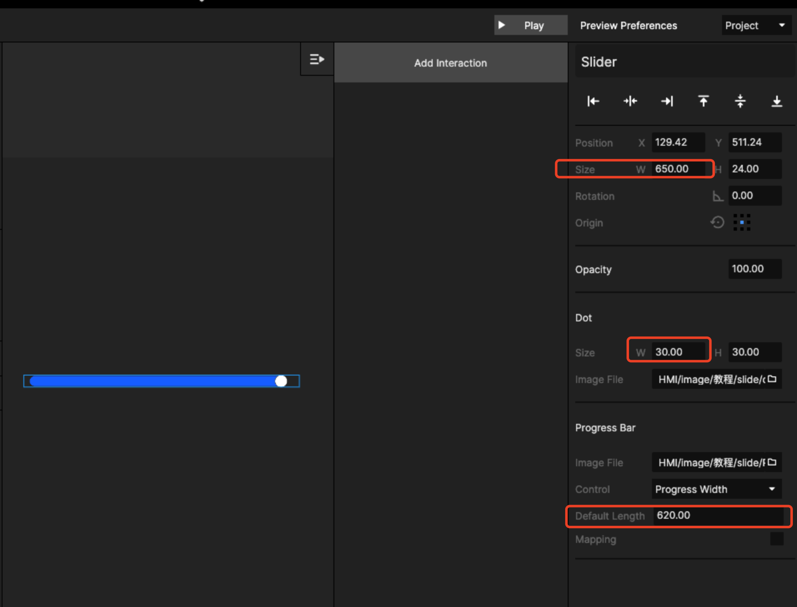
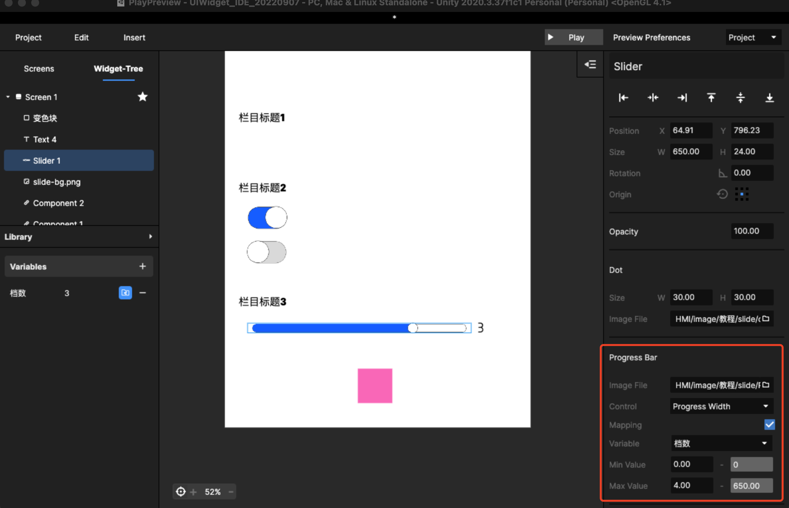
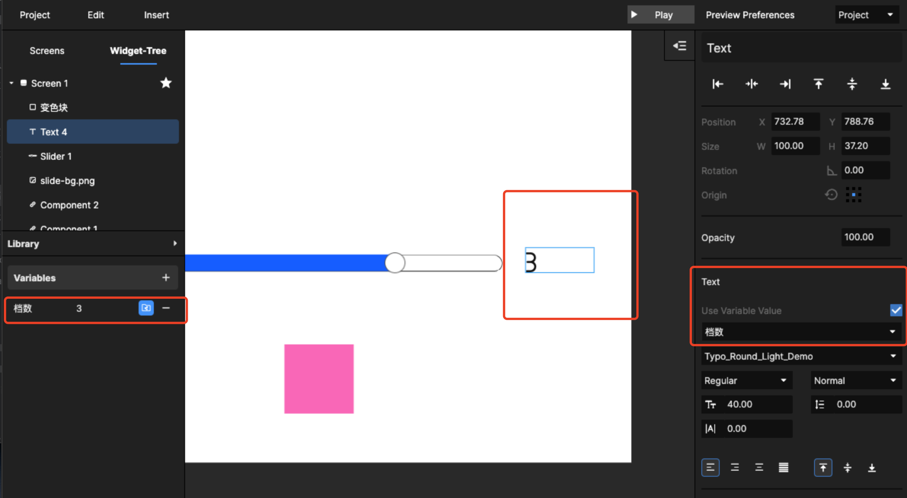
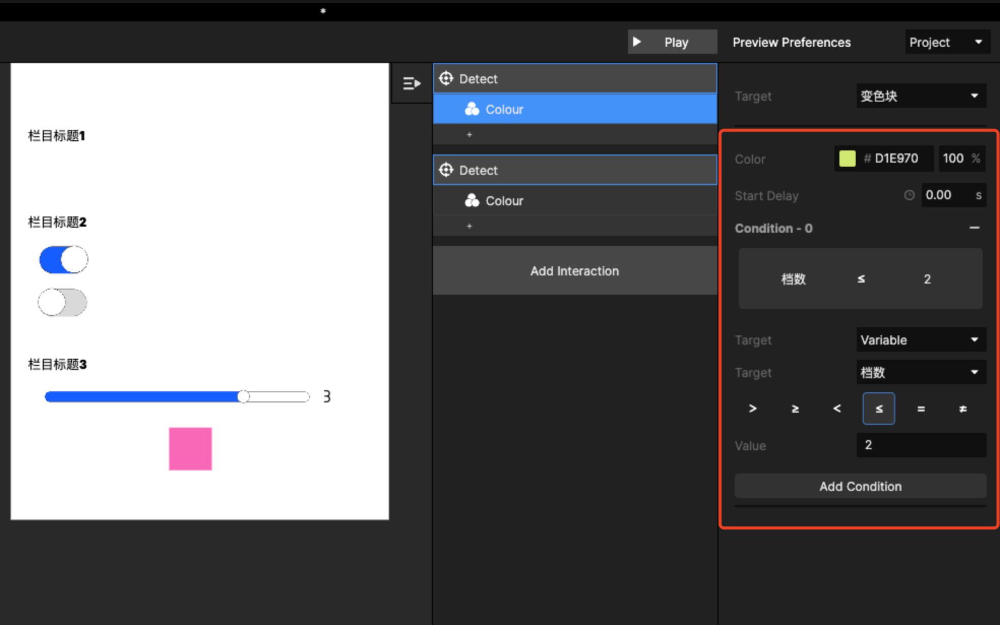
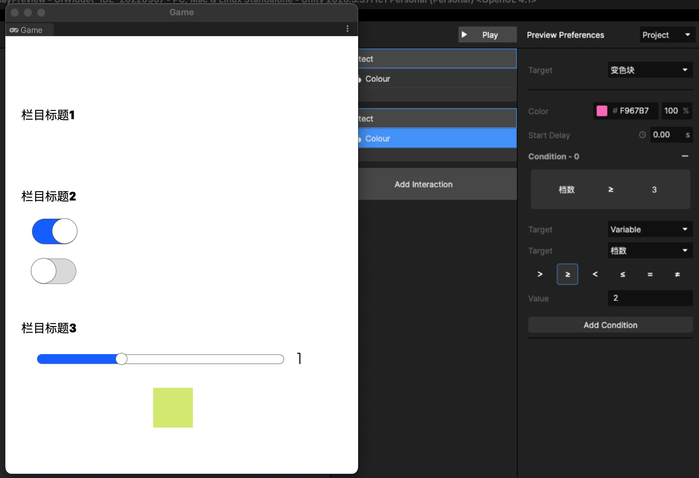

# 3. 如何做 Slide 控件？

## Step1、先在有slide的页面放入slide

<figure><figcaption>
从扩展库拖入
</figcaption></figure>

把已经切好图、量好尺寸的slide元素导入到控件中：

<figure><figcaption>
导入dot
</figcaption></figure>

本设计稿中，Dot 的尺寸是 30\*30

<figure><figcaption>
导入Progress
</figcaption></figure>

注意！导入Progress时一定要导入设计时 Progress 最大的情况，最大的尺寸！

<figure><figcaption>
调整 slide 的尺寸
</figcaption></figure>

导入后需要对应调整整个slide的尺寸！\
如果是横向滑动，则是在width方向加上dot的width\
如果是竖向滑动，则是在hight方向加上dot的hight！\

&#x20;需要补充说明的是，slide 目前支持水平和垂直两个方向，滑动方向是从左往右，或者从下往上，如果需要反向滑动，这需要整个slide旋转180度\

<figure><figcaption>
slide 底部有背景
</figcaption></figure>

slide底部的图层是静止的，所以不做在控件内，是做在图层中，可以另外切图导入当前画板中。

## Step2、设置滑动slide范围（可选功能）

开启mapping映射功能，增加一个变量值，其变量数值范围可以和滑动范围一一对应。

<figure><figcaption>
变量对应关系
</figcaption></figure>

滑动像素范围是0-650；变量范围是：0-4（0、1、2、3、4）自动取整数

可以把变量值显示在画面上，增加text文本，文本使用同一个变量即可

<figure><figcaption>
通过文本显示变量
</figcaption></figure>

## Step3、监听变量来改变其他元件（可选）

新建交互，通过Trigger监听来跟踪滑块改变的变量值，增加Action，以本教程为例，改变方块的颜色。

需要改变前设置condition，即变量控制的逻辑调节，如下图所示：\
\
滑动滑块，当变量小于等于2时需要改变方块颜色为黄绿色

<figure><figcaption>
 设置条件逻辑
</figcaption></figure>

## Step4：预览并调节你的设置

点play预览设置效果，是否有条件变量有误的情况

<figure><figcaption>
预览检查设置
</figcaption></figure>

另外slide的滑动变量需要被当前文件外的文件引用时，需要点开变量exposed的功能，方便后续再次使用当前滑动值。

以上流程和步骤可以参考视频：




