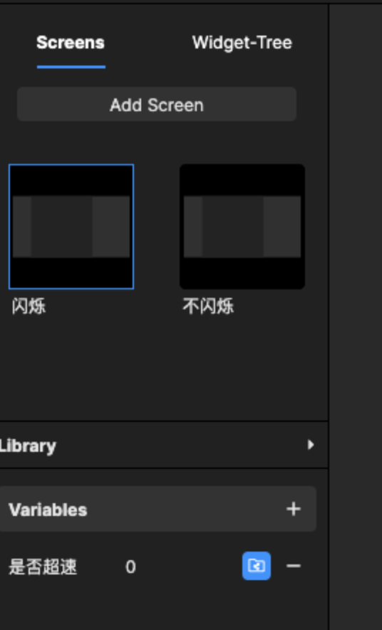

# 4. 如何做限速 icon （定制功能）

**假设**限速功能的逻辑：

当车速大于当前限速5km/h时（当前限速为40km/h），车辆将进行报警，报警方式为限速标志闪烁三次，限速路段中：\
车速依然大于45km/h时限速标志不消失，\
车速小于限速40km/h后限速标志消失。

提醒：本功能所需要的车速数据来自硬件，硬件通讯数据在系统内是topic信号，需要定制，本设计稿通过变量来模拟车速。

## Step1：先设计会闪烁3次的 icon

建立一个和icon同一尺寸的画板，然后分成2个状态，一个是闪烁，一个是不闪烁

<figure><figcaption>
icon 的两个状态
</figcaption></figure>

在闪烁画板中拖入icon素材，并设置icon初始的透明度

<figure><figcaption>
拖入画板时是100，需要再改成0
</figcaption></figure>

然后增加闪烁交互通过 Start + Opacity来调节其icon的闪烁

即透明度随时间从0变成1再变化为0，出现消失，

一共设置3次出现，前2次消失，最后一次不消失

<figure><figcaption>
每次变化随时间叠加
</figcaption></figure>

第一次闪烁：0s后出现，1s后消失

第二次闪烁：2s后出现，3s后消失，

第三次常亮：4s后出现

增加变量来切换Screen状态\
设置一个是否超速的变量，默认为0不超速，即页面无显示内容；但是改变当前变量则为超速\
两个页面同时监听该变量值，确定是否需要切换状态

<figure><figcaption>
超速变量
</figcaption></figure>

<figure><figcaption>
监听变量
</figcaption></figure>

注意！超速变量必须exposed状态，如果已经exposed为被读取，需要再次打开确认一下！

## Step2：设计需要引用icon的地图页

新建页面尺寸，按设计稿把icon的 X轴、Y轴坐标量好

insert 一个Component，设置文件地址为icon

建立超速变量，然后选中Component中变量进行Override

<figure><figcaption></figcaption></figure>

建立车速变量，数据来源硬件需要提前定制 topic信号

<figure><figcaption></figcaption></figure>

设置交互，监听车速，改变超速变量

<figure><figcaption>
在condition中设置限速
</figcaption></figure>

#### 注意事项

因为 topic 的模拟需要用插件，只针对定制用户，此处模拟可以使用建立模拟车速变量来提前查看效果，具体内容有下述视频。





另外icon闪烁其实也可以通过gif导入，更好做，本次为了讲解更多功能做了最复杂的设计。

