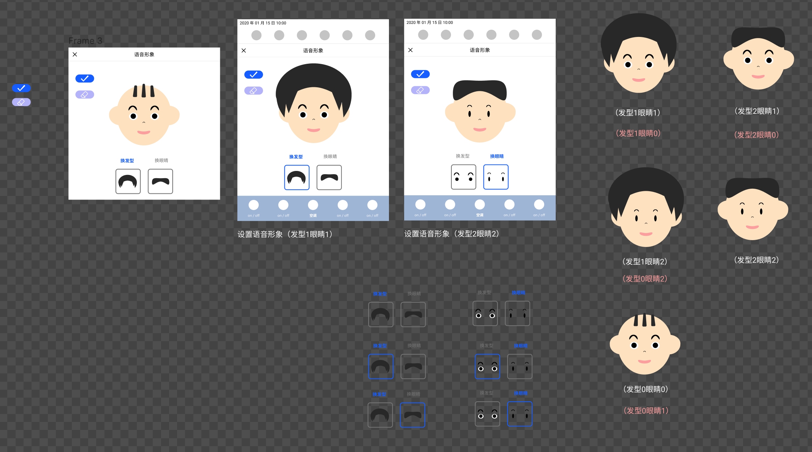
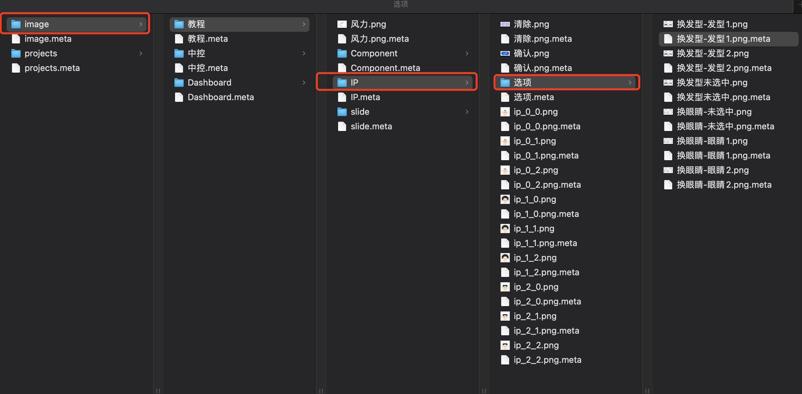
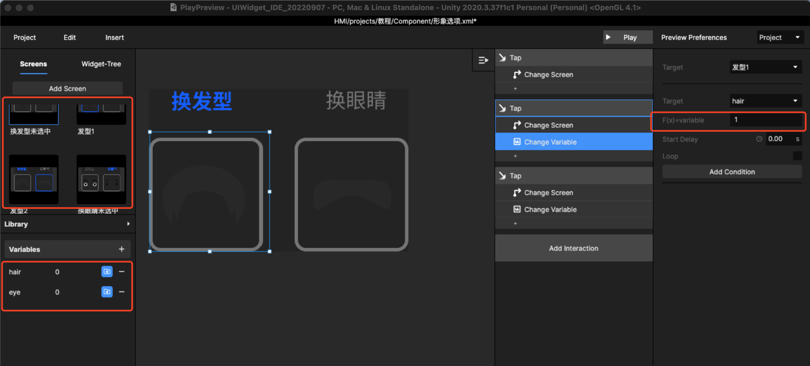
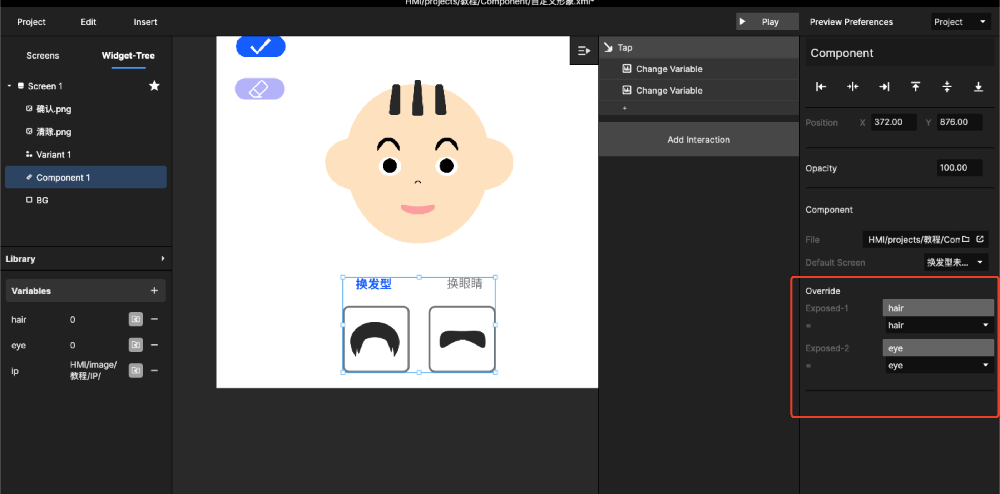
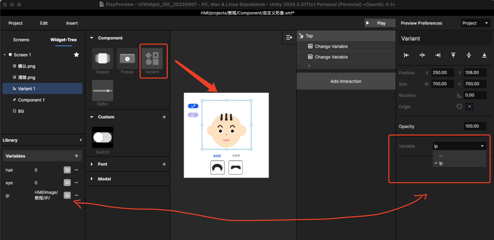
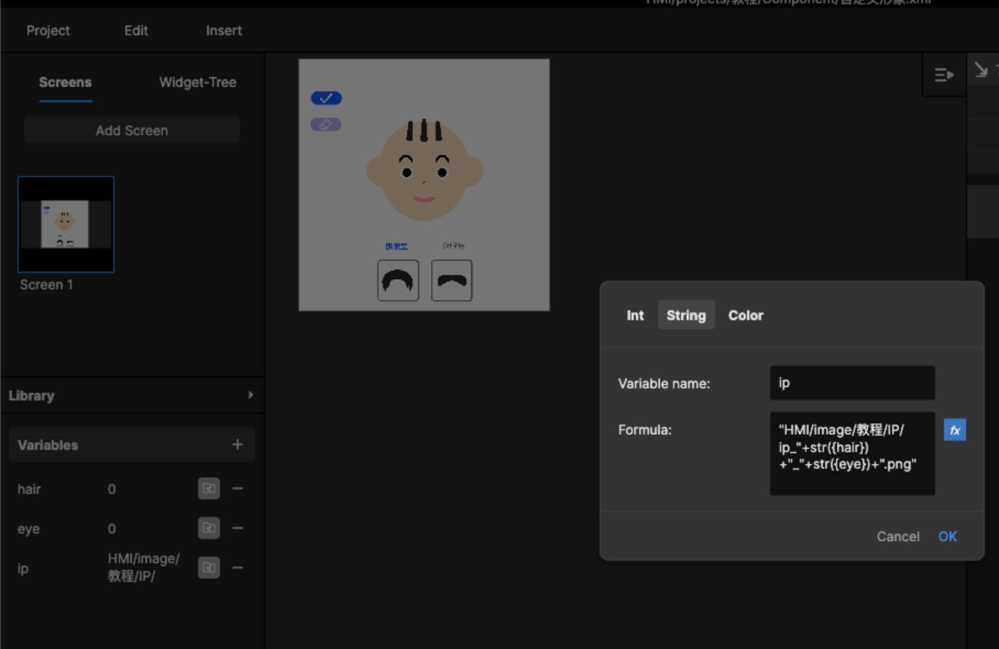
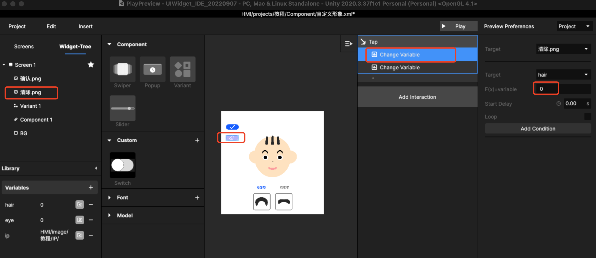
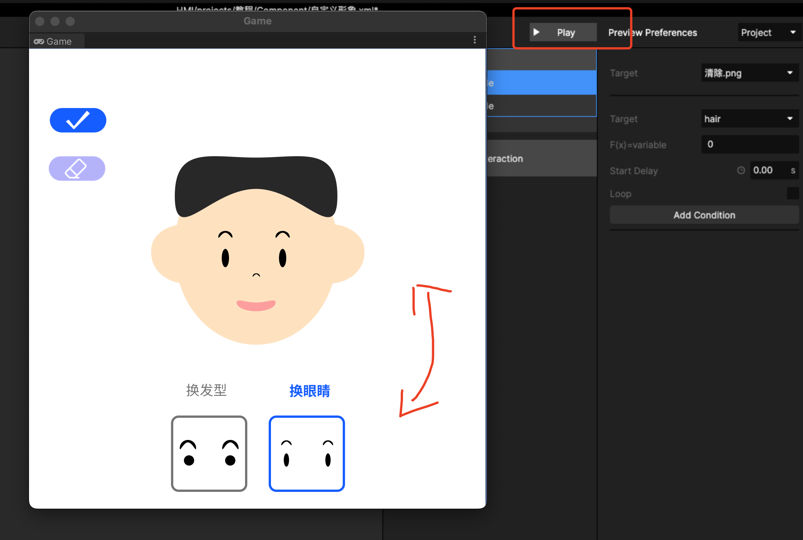
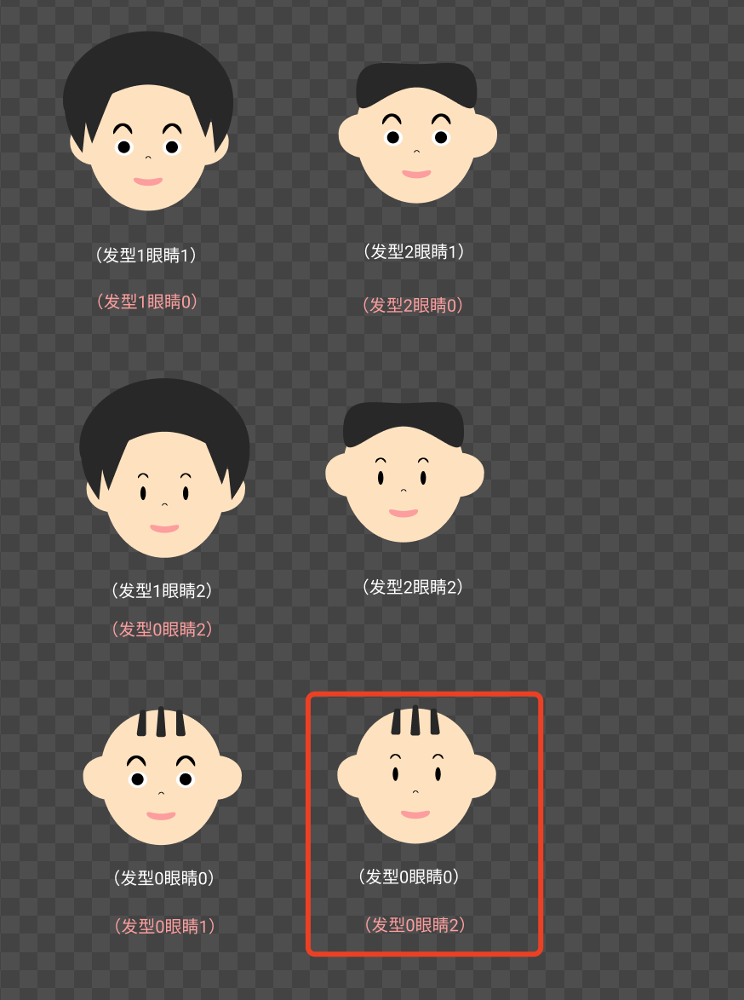

# 5. 如何做自定义形象？

## Step1：要规划好设计方案&#x20;

设计思路：用Component做选项，通过变量来控制形象，形象通过变体去实现，引用了一个变量组合&#x20;

做好设计前的准备：要注意文件名、做切图准备

<figure><figcaption>
切图准备
</figcaption></figure>

<figure><figcaption>
文件夹逻辑和命名
</figcaption></figure>

变体的函数表达格式："HMI/image/教程/IP/ip\_"+str({hair})+"\_"+str({eye})+".png"

## Step2：做选项Component组件&#x20;

建立所有选项之间的跳转关系 建立函数\
\
hair函数默认0，然后点击后改变为1或2，且点击会发生跳转\
eye函数默认0，然后点击后改变为1或2，且点击会发生跳转

<figure><figcaption></figcaption></figure>

注意：函数需要exposed！

## 第三步：设计需要放入Variant控件的页面&#x20;

插入选项组件，建立Override函数关联&#x20;

<figure><figcaption></figcaption></figure>

插入变体，设置变体为函数

<figure><figcaption></figcaption></figure>

函数参数设置："HMI/image/教程/IP/ip\_"+str({hair})+"\_"+str({eye})+".png"\
即路径加子函数名称的组合函数

<figure><figcaption></figcaption></figure>

补充页面其他功能，比如清除功能 复位函数时需要再到选项组件中增加监听函数

<figure><figcaption>
增加交互
</figcaption></figure>

## 第四步：反复去检查&#x20;

通过预览点击事件和效果，是否存在漏素材的情况，并进一步补充，使其符合逻辑

<figure><figcaption>
通过预览点击测试效果是否一致
</figcaption></figure>

具体设计过程可以查看视频：







