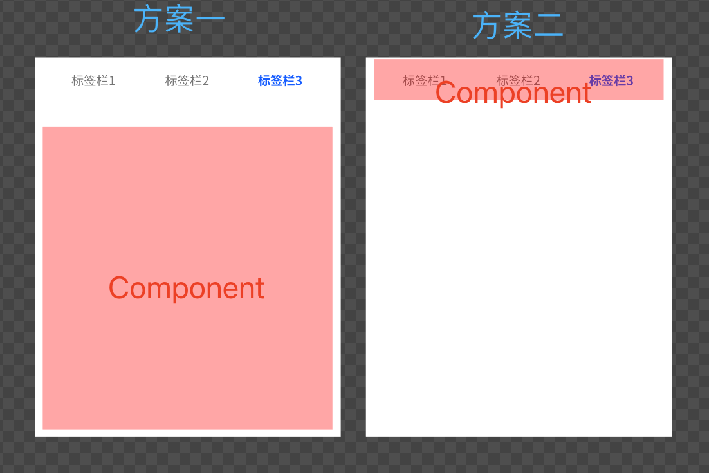
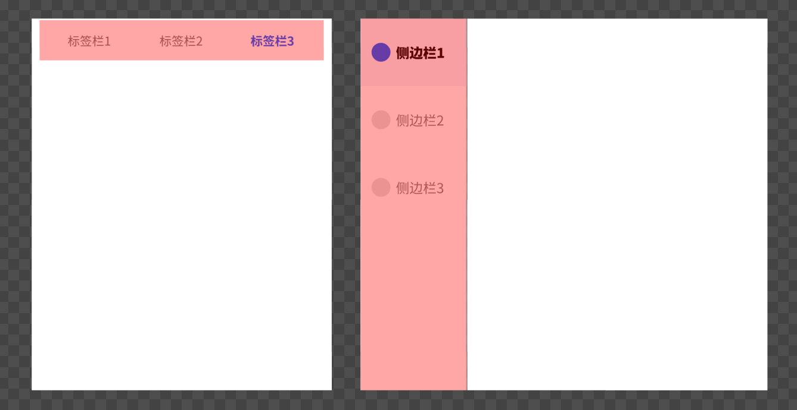
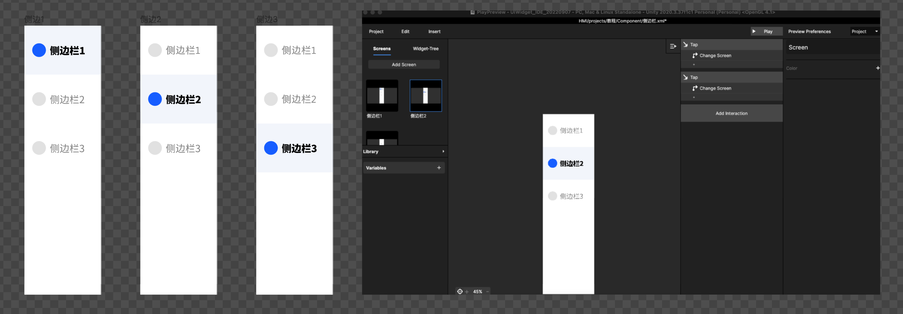
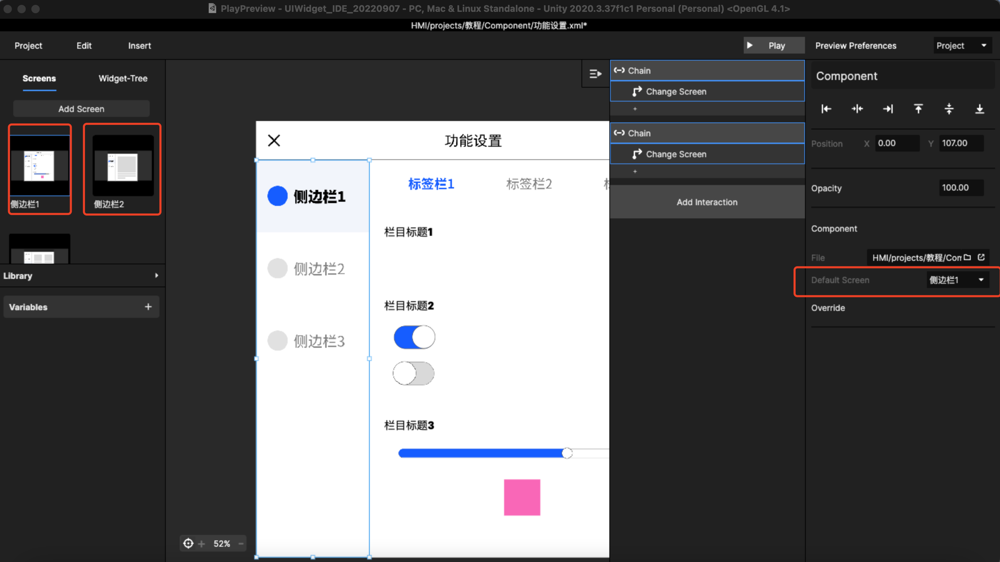
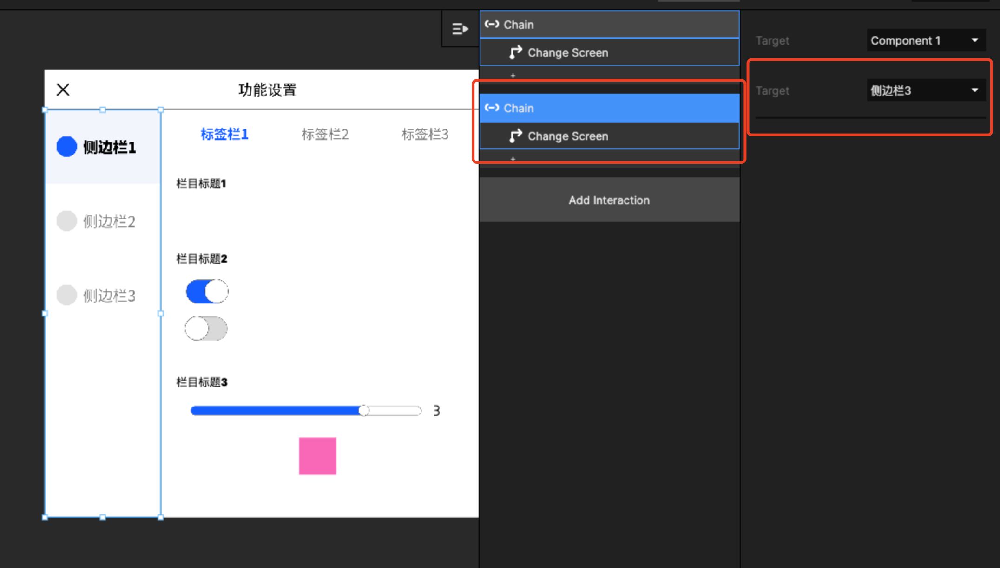

# 6. 如何做 tab 标签栏？

有两种做法，都可以实现tab栏，可以自行选择。\
方案一：把内容做成Component，方便后期增加内容\
方案二：把标签做成Component，防寒后期增加标签栏，补充更多内容。\

<figure><figcaption></figcaption></figure>

两个方案都很简单，只要增加其他tab标签的热区并且增加交互，tap+change screen即可\
但是方案二中需要运用chain功能，参考以下步骤：

## Step1：先制作侧边栏xml：

下图都是同一个方案，都是把tab栏作为Component，由于子栏目设计使用方案一，所以侧边栏设计使用方案二演示

<figure><figcaption>
tab 栏使用Component
</figcaption></figure>

设计前做好准备工作，和方案一的跳转逻辑其实是一致的，做好 Component

<figure><figcaption>
切好图、做好每个screen的跳转
</figcaption></figure>

## Step2：新建功能设置画板，把侧边栏放入

新建画板后和侧边栏一样新建多个screen，然后每个screen都命名，同时都insert Component，把Component设置为侧边栏，但不同的screen中，Default Screen是不一样的，需要和上一步做好的内容同步。

<figure><figcaption>
每个Screen都需要侧边栏Component
</figcaption></figure>

## Step3：chain 侧边栏的状态设置当前页面跳转

选中侧边栏的Component时，可以增加Trigger-chain，选中需要跳转的screen状态，然后增加Action，设置跳转

<figure><figcaption>
chain哪个状态跳转哪个页面
</figcaption></figure>

完成设置，预览即可，后期可以增加更多内容。

详细设置经过可以参考下述视频：





