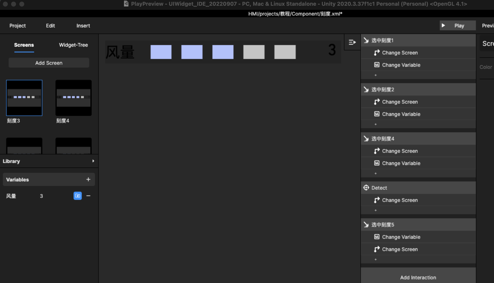
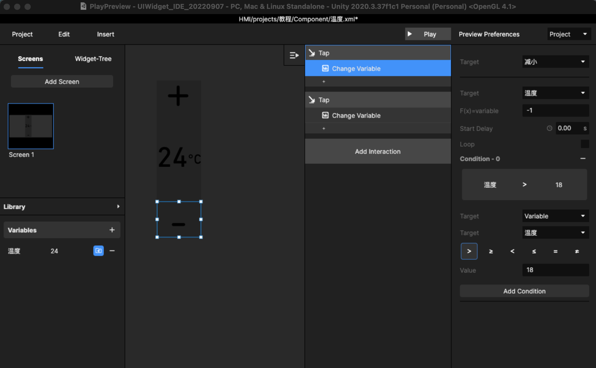
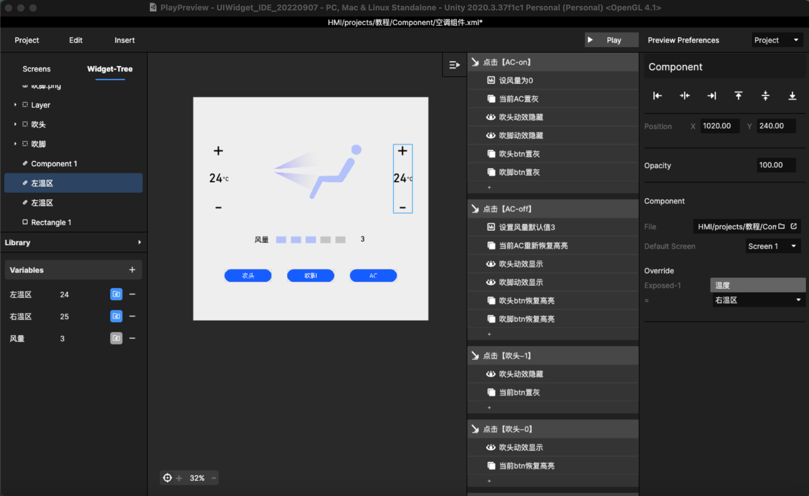
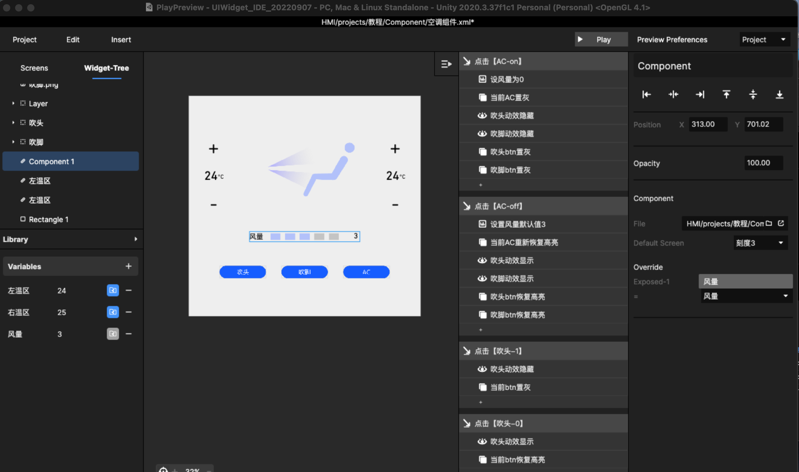
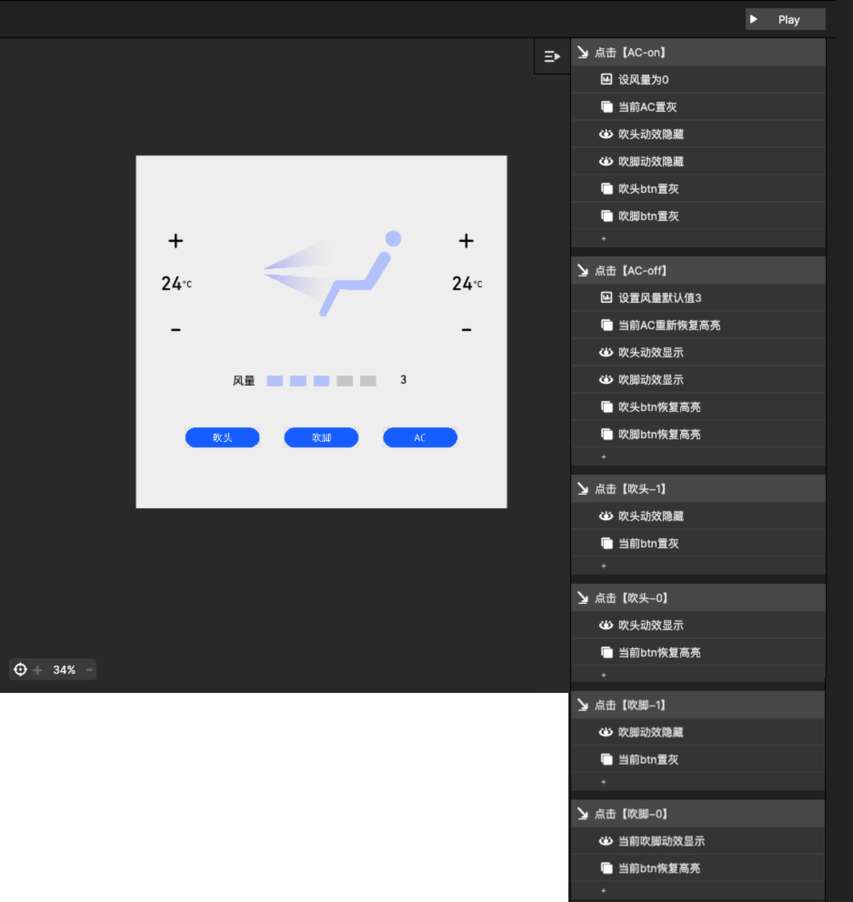
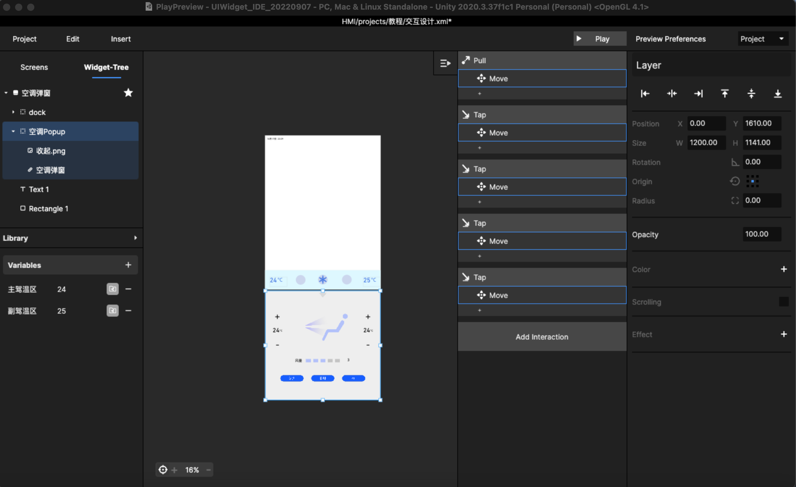

# 7. 如何做空调弹窗？

呈现空调的内容未必会是一个弹窗，但可以是弹窗，通过上划dock栏展开。

整体的设计思路是划分层级关系，从小组件开始制作，然后一步步嵌套在整个交互方案中。

以下内容只是一个简单案例：

## Step1：设置小组件

先做风量刻度、空调温度，具体查看视频：



<figure><figcaption>
风量刻度
</figcaption></figure>

风量组件制作注意点：\
1、除了1-5刻度，还需要做0刻度\
2、需要做变量监听刻度状态，并暴露变量\
3、在0刻度时增加监听变量，可以为后续设置风量开关使用

<figure><figcaption>
温度组件
</figcaption></figure>

温度组件制作注意点：

1、页面上虽然有多个温区，但只需要做一个组件，复用即可\
2、最高温度和最低温度区间可以通过condition来做条件限制\
3、温度变量进行暴露，后续可以被多次复用

也可以做slide，方法和其他slide相同，此处省略

## Step2：制作空调组件

把上一步做的组件汇总放在空调组件内，并补充空调组件内的功能，具体看下述视频：



insert 组件，再Override组件内的变量

<figure><figcaption>
2个温度组件分别做为左右温区
</figcaption></figure>

<figure><figcaption>
风量变量Override
</figcaption></figure>

注意事项：

1、切图时，需要命名更清晰，方便设置\
2、在做设置前理清页面各个button的逻辑，这里的【关闭AC】时需要通过联动其他两个button

\
设置button逻辑：

1、高亮和置灰的两个状态通过Reorder来切换两个状态\
2、通过显示和隐藏模拟风量层来同步开关状态

设置参考如下：

<figure><figcaption>
组件内的交互设置参考
</figcaption></figure>

## Step3：把空调组件做成弹窗

理解页面层级，把空调组件insert到方案中，通过增加热区并设置组件move的方式制作弹窗，具体参考以下视频：



导入之前收起按钮，和上一步的空调组件 group 组成 Layer，改名为空调弹窗，并且把该图层的位置设置在背景和dock栏之间，然后设置空调弹窗的动效

<figure><figcaption>
使用 Action - move 
</figcaption></figure>

