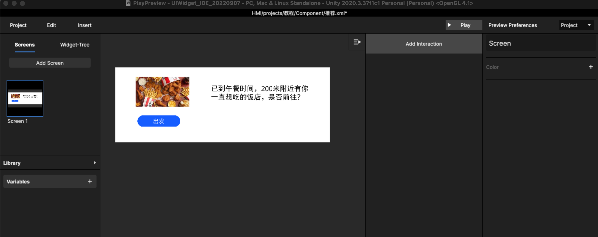
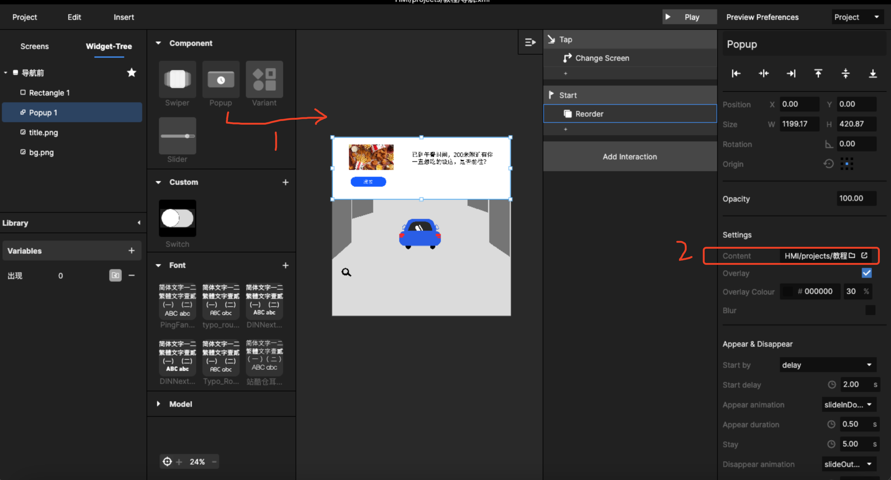

# 8.如何做主动服务popup？（内容定制）

## Step1： 设计弹窗内容

弹窗内容可以是语音对话的，也可以是多页面的，形式不受限制，制作在单个xml文件中

<figure><figcaption>
设计案例
</figcaption></figure>

## Step2：在需要服务的页面中导入 popup 组件

先拖入组件，再引用路径找到上一步制作的弹窗内容

<figure><figcaption>
 导入主动服务内容
</figcaption></figure>

根据需求设置[popup的功能](../zu-jian/2.-kuo-zhan-zi-yuan-ku-chang-yong-zu-jian/2.2-popup.md)，如出现动效、消失动效、蒙层等。

## step3：补充操作逻辑

需要注意的是，如果主动弹窗服务1次，再次进入时，上次弹窗则不出现，这个交互逻辑可以通过变量来控制，操作如下：

1、新建一个“出现”变量，设置初始值为0\
2、从其他页面返回时，设置change screen 的同时 change Variable ，改变“出现”变量，使其不等于0的任意数，如：9等\
3、设置服务页面的交互 Start + Reorder，改变 popup 的图层在最后一页，被遮挡，或者是 Start + Opacity ，改变 popup 的图层透明度为 0，不可见；同时在Reorder / Opacity 的时候增加 condition，满足 “出现”变量=9

这样即可满足 popup 只出现一次。

以上制作步骤可以参考如下视频：





另外补充：

其实popup的样式和Component的逻辑差不多，但是方便设置动效，不需要通过move设置，但是会每次到页面就会出现一次，除非做变量限制，具体看需要使用。

