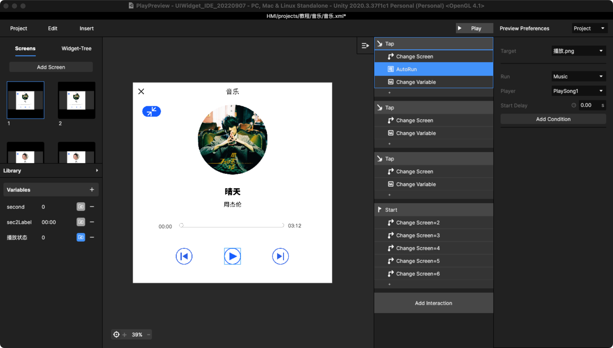

# 9. 如何做音乐播放器（定制功能）

举例，做一个类似这样的播放器交互：

## Step1：先制作音乐页

三首音乐，就要区分6个状态，做成6个screen\
同时需要增加变量来记录当前状态

1-曲目1的暂停状态，带播放按钮\
2-曲目1的播放状态，带暂停按钮\
3-曲目2的暂停状态，带播放按钮\
4-曲目2的播放状态，带暂停按钮\
5-曲目3的暂停状态，带播放按钮\
6-曲目3的播放状态，带暂停按钮

分别设置交互，分别发生3类Action

**1）change screen**\
1到6的可以点击的播放按钮都是需要设置change screen逻辑到对应页面的

**2）change Variable**\
****每次change screen，change到哪个页面就改变成什么变量\
1-点播放按钮到2，改变变量到2\
2-点播放按钮到1，改变变量到1\
同理，3-4；5-6\
上一曲和下一曲也是都改变变量\
\
**3）设置AutoRun播放定制的音乐**\
1、3、5是暂停状态的，到达2、4、6都是播放对应的曲目，反之暂停对应曲目\
而下一曲和上一曲是只做在2、4、6播放状态中的，分别autorun后一首和前一首对应的曲目\
选曲目的时候：playsong- N，而这个N和做页面顺序很很大关系，是一一对应的\

<figure><figcaption></figcaption></figure>

另外，需要增加 start + change screen，每个condition是监听播放状态变量，以和其他播放器保持同步状态。

具体设置可以参考下述视频，还包括的slide中有显示时间的变量：



## Step2：同样设置其他的播放器

<figure><figcaption>
首页播放器-长
</figcaption></figure>

<figure><figcaption>
首页播放器-小
</figcaption></figure>

并且需要增加 decete + change screen 也是为了保持3个播放器可以同步，所有的变量需要 exposed 。

##

## Step3：增加一级页面，把音乐页insert进去

一级页面中按照功能划分，在音乐状态下，新增 Component ，把音乐页导入进一级xml中

新增一个 Variable 用来在父级xml文件中“开启”小播放器。

<figure><figcaption></figcaption></figure>

默认为0，点击后改变Variable为1，后续可以用来监听。

## Step4：整合以上Component放在交互方案中

把一级页面 insert 在交互方案中（先Default音乐状态），并且 Override 所有的变量。

<figure><figcaption></figcaption></figure>

设置对需要显示和隐藏首页播放器的监听+move：

<figure><figcaption></figcaption></figure>

梳理播放器的逻辑pull划动+move

<figure><figcaption>
播放器中增加划动热区再group
</figcaption></figure>

梳理后再预览，另外需要补充的，一级页面点击“音乐”状态可以改变变量，使其为0，恢复成原状态。\

具体可以参考下述视频：



