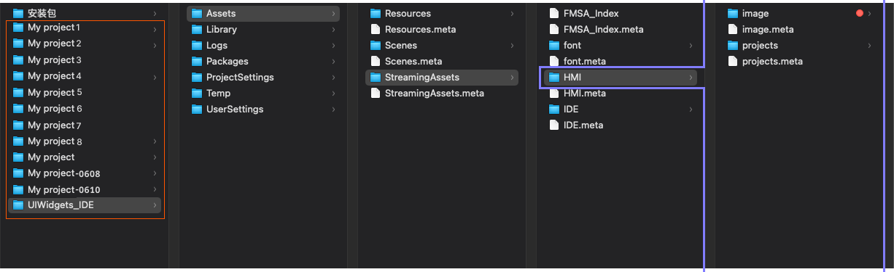

# 1. 项目文件（Projects）




[2.-unity-de-ji-chu-dan-wei-project.md](../../ji-chu-jiao-cheng/2.-unity-de-ji-chu-dan-wei-project.md)





[3.-xin-jian-huo-zhe-da-kai-she-ji-su-cai.md](../../ji-chu-jiao-cheng/3.-xin-jian-huo-zhe-da-kai-she-ji-su-cai.md)




Unity 是以 project 来作为文件分类的，从  Unity Hub 中打开或新建，即如下所示：

建立新的 HMI Project ，都是通过在编辑器中的 HMI  toolkit Template 建立的，具体建立方法，可以查看安装教程中的第3步。

每一组 Project 的文件保存的具体路径如下图所示中，即 HMI 设计稿最终产出物的位置。

Mac 中橙色框出 Project，紫色框出产出物；Windows 略有不同，结构一致。

路径为 Project 的位置的子文件中：Project名称/Assets/StreamingAssets/HMI

