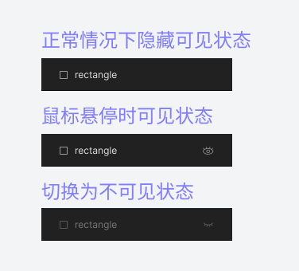
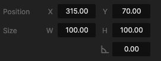
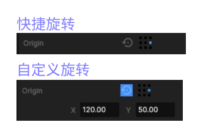
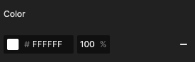
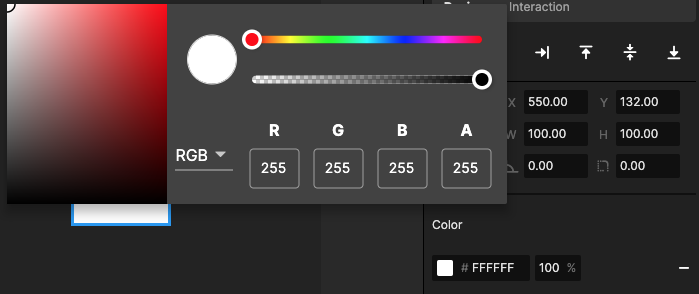

# 4. 元件图层（Insert）

## 1、元件表

IDE 编辑器的编辑方法同其他设计工具十分相似。支持添加矩形、圆形、等常用图层后，可以调整其尺寸和位置，具体如下表所示：

| 名称        | 图层类型        | 支持编辑属性             |
| --------- | ----------- | ------------------ |
| Layer     | 一般指多图层组合    | 基础属性、scrolling滑页功能 |
| Image     | 图片，同时包含GIF等 | 基础属性、来源文件          |
| Rectangle | 矩形形状        | 基础属性               |
| Line      | 线段          | 基础属性、粗细            |
| val       | 椭圆          | 基础属性               |
| Text      | 文字          | 基础属性、字体属性、变量       |

## 2、基础属性

元件图层通用的基础属性包含以下内容：

### 1、图层元件可见/不可见

悬停时可以查看元件的 visibility 状态，用于图层元件的交互编辑

### 2、排列方式

一般指远中元件与 Screen 的位置关系

### 3、位置与尺寸

在 intert 元件图层后输入数值进行调整

### 4、旋转

同时支持快捷旋转与自定义旋转，快捷旋转即旋转中心点位置在原形状的最大矩形角、中心点，自定义旋转则为编辑中心点位置，或鼠标直接拖拽中心点

### 5、颜色与透明度

颜色工具支持多种调节方式：

### 6、透明度

指元件图层的透明度，可以改变元件出现或消失

### 7、元件效果

默认不增加Effect，如果增加Effect，可以选择高斯模糊和阴影

高斯模糊可以设置模糊程度

阴影则设置阴影颜色和偏移角度（可支持负数）

## 3、其他元件图层

常用控件的属性在[组件库](../zu-jian/2.-kuo-zhan-zi-yuan-ku-chang-yong-zu-jian/)中介绍，

3D模型属性在[3Dview](../3d-mo-xing/2.-3d-view/)中介绍。

上述两者都是元件的复杂形态，包含元件图层部分基础属性。\

