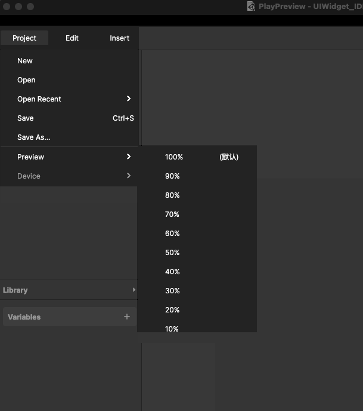
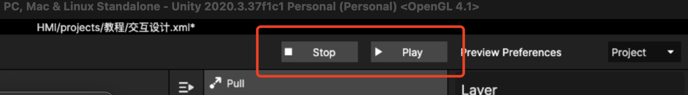

# 5. 预览演示（Play）

## 1、可以在电脑上预览

a. 从 Project 点开可以预览当前编辑的xml文件

预览时，可以设置预览窗口的尺寸由于存在设计的尺寸会大于显示，所以默认字样的表示当前显示器推荐预览的最佳尺寸：

b. 快捷预览，可以预览当前页面

在窗口右上角可以选择Screen进行预览，即当前选中的Screen

直接点击 play 后可以按上一次设置的百分比进行预览，未设置过则按默认百分比预览

点击预览窗左上角的关闭会暂停当前的预览，继续编辑

<figure><figcaption></figcaption></figure>

但同时，预览过程中会出现 stop按钮，点击则停止预览并关闭预览窗，如果是包含3D素材或多媒体制作需要点击该按钮停止预览

<figure><figcaption></figcaption></figure>

## 2、可以在移动端预览

点击 project 的 evice，即可以通过同一 WiFi 下的 Android设备进行预览，Android 设备中需要预下载 [Preview App](../bu-chong/demo-yu-lan-shi-yong-de-app.md)

