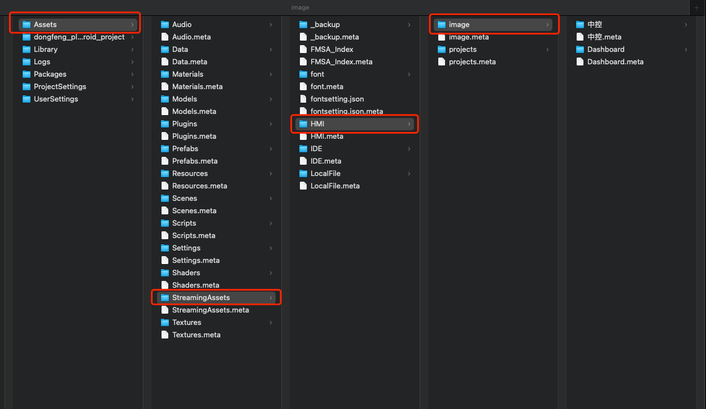

# 7.1 导入图片

### 1、导入项目文件夹中

### .png>)

在设计过程中需要把设计切图先导入项目文件夹中，以便后续使用

<figure><figcaption>
导入路径
</figcaption></figure>

### 2、取用图片

导入路径如图所示，image文件夹内可以继续建立子文件夹，均可以被项目本身识别

可以通过insert一个image的方式引用在设计文件中，也可以拖入画布中。

<figure><figcaption></figcaption></figure>

<figure><figcaption>
拖入图片
</figcaption></figure>

