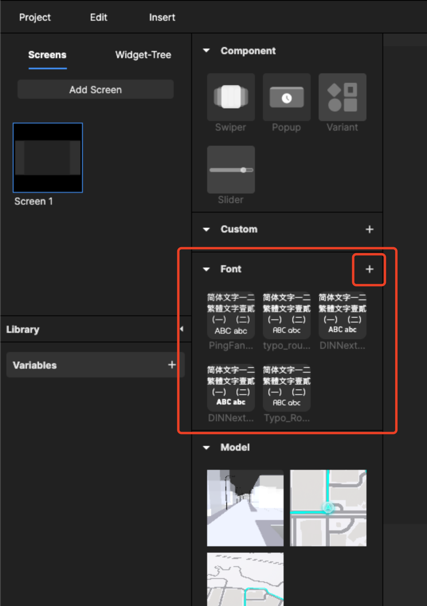
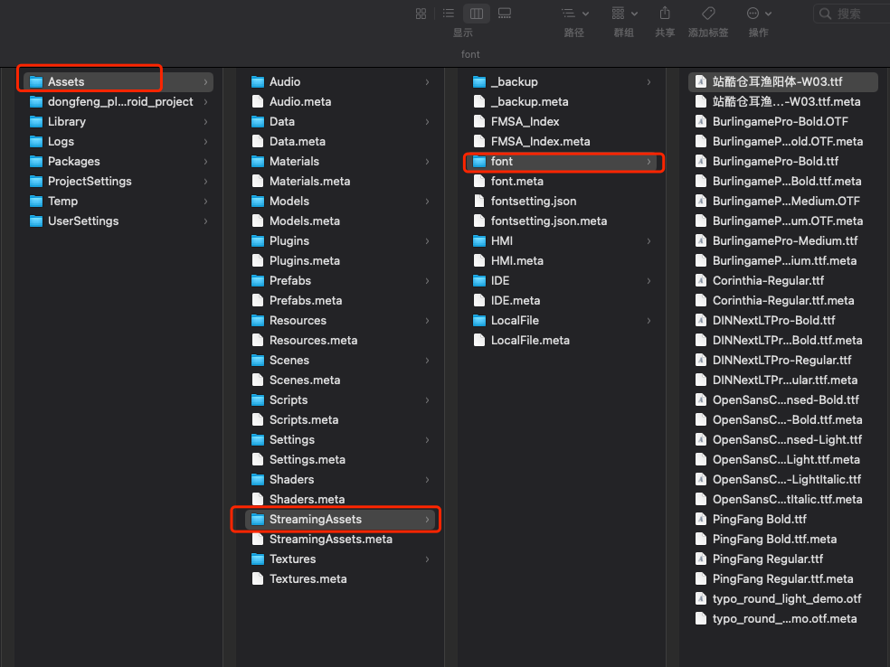

# 7.2 导入字体

如果当前的设计需要用多种的字体，可以直接在扩展资源库上传

<figure><figcaption></figcaption></figure>

上传后需要重新打开编辑器（关闭前记得保存已编辑的文稿），再次打开后就可以使用新上传的文字了，文字文件已安装下述工程文件夹中

<figure><figcaption>
当前Project下的路径
</figcaption></figure>

