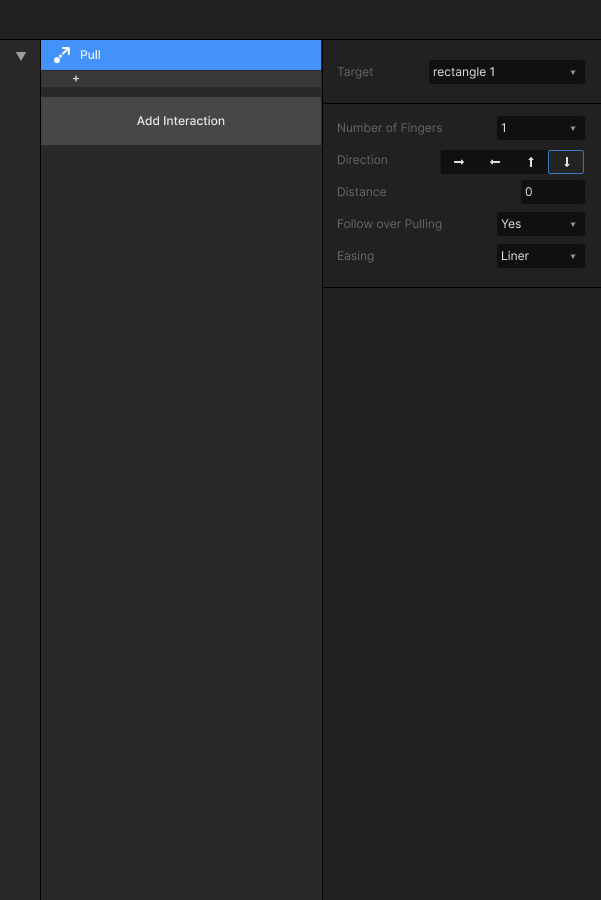
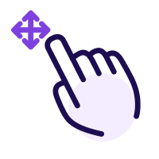
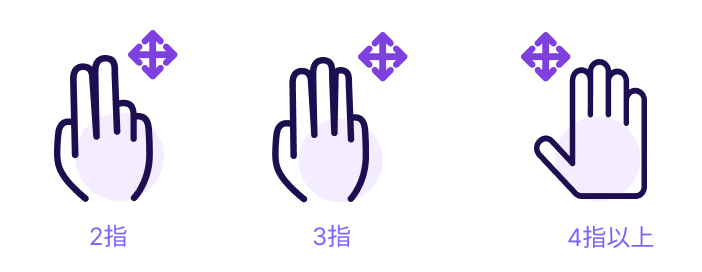

# 2.4 划 Pull

### 

### 功能描述：

触发交互动作：推拉触发是一种含有成功和失败概念的触发方式。图层被拖动超过一定距离或一定速度时，则认为拖动成功。成功时图层将按照用户指定的距离发生移动，失败时图层回到原来的坐标。

### 设置属性：

可以设置手指个数，手指移动方向；\
元件图层的移动位置的距离，以及手指滑动超过图层指定停止位置时，对元件图层的处理方式，与图层移动是的滑动效果。

### 可支持Target：

目前支持目前所有的元件图层，但不包含Screen、组件。

