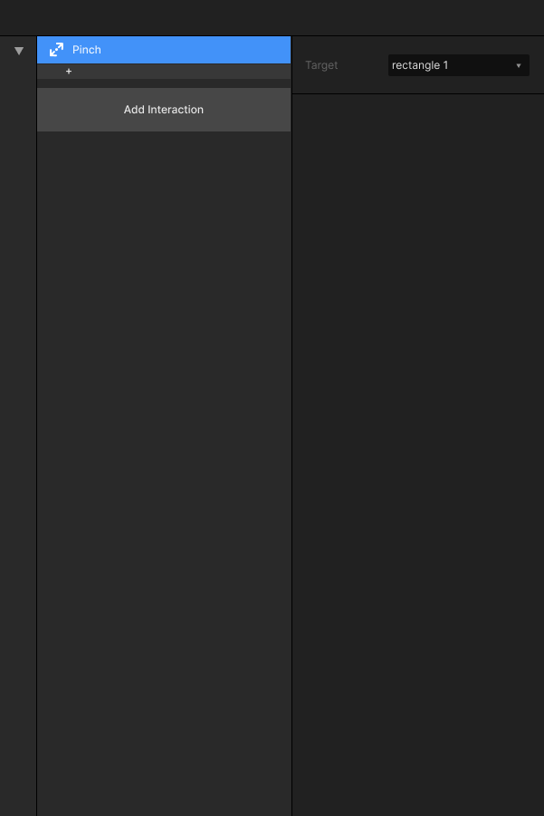

# 2.6 捏合 Pinch

### 

### 功能描述：

触发交互动作：夹捏，双手指在屏幕上合拢或分开的动作。

### 可支持Target：

目前可支持的图层元件有“Rectangle”、“Image”、“Oval”、“Layer”。

### 对应 Action

目前有对应 Pinch 的独立 action： [Scale](../3.-dong-zuo-fan-kui-action/3.5-gai-bian-chi-cun-scale.md) 。

