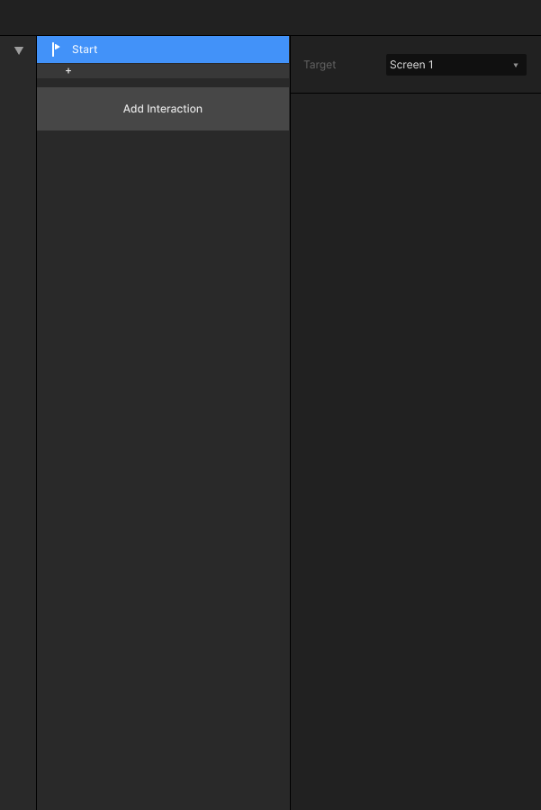

# 2.8 启动 Start

### 

### 功能描述：

触发交互动作：启动直接触发。

该功能即用来配置进入当前Screen的状态。

### 设置属性：

可以输入信号内容配置

### 可支持Target：

按场景支持模拟信号，支持 Screen、Test、3D 模型。

### 对应 Action

目前有对应的 [Action - AutoRun](../3.-dong-zuo-fan-kui-action/3.7-zi-dong-yun-hang-autorun-ding-zhi-gong-neng.md) 去 执行该预设的 Topic。

