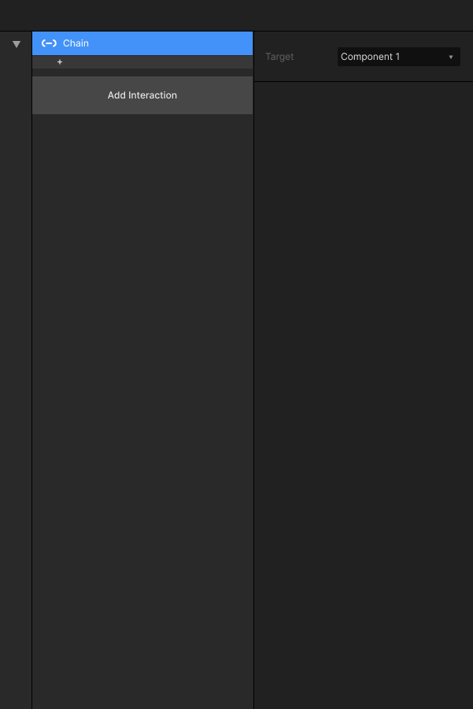

# 2.9 关联 Chain

### 

### 功能描述：

触发交互动作：关联组件（component）中的触发并发生控件组的触发。

### 设置属性：

可以选择被触发的组件（component）中的某个 Screen 进行联动。

### 可支持Target：

目前仅支持 [组件（component）](../../zu-jian/1.-ke-qian-tao-zu-jian.md)。

