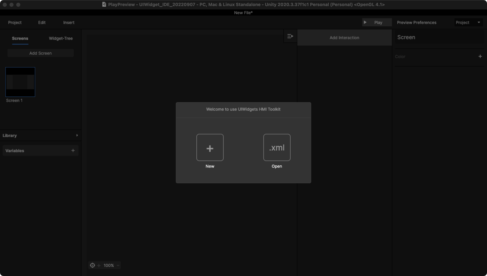
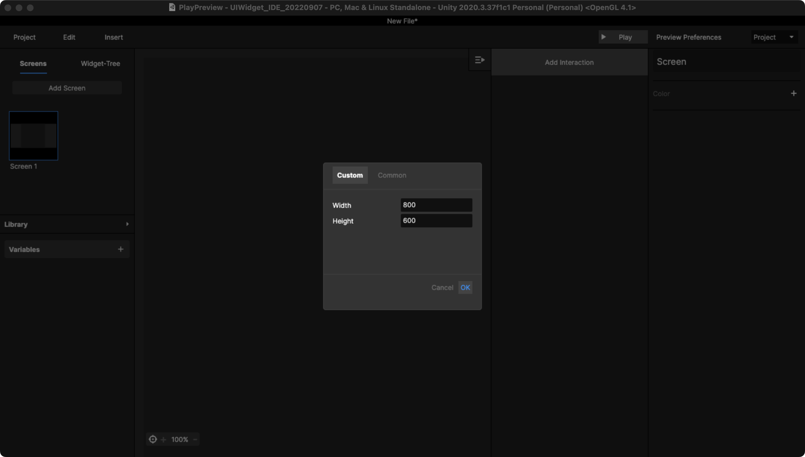
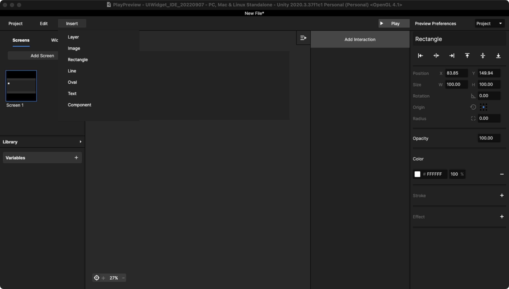
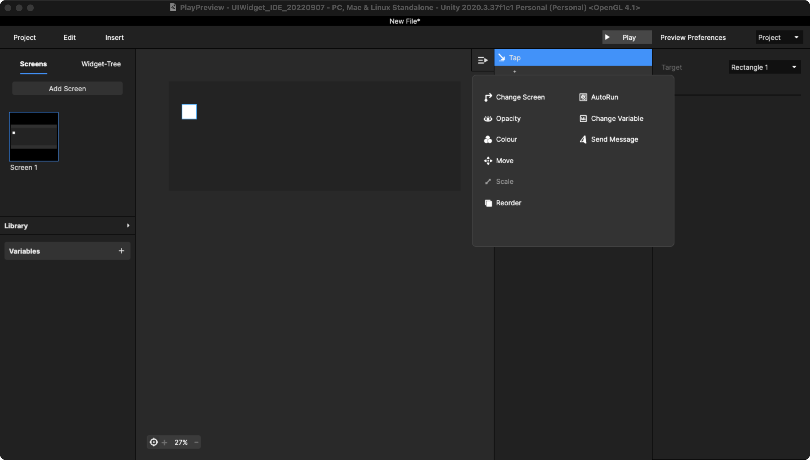
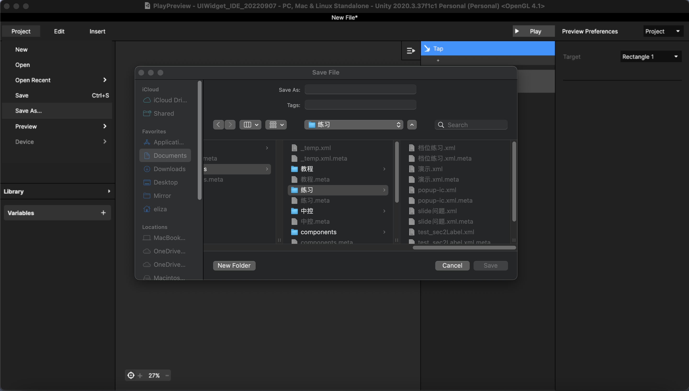

# 1. 使用基础

## Step 1 ： 建立 Screen 画板

打开编辑器，新建时设置 [Screen 的尺寸](1.-shi-yong-ji-chu.md#step-1-jian-li-screen-hua-ban)。

<figure><figcaption>
打开编辑器，点击new
</figcaption></figure>

<figure><figcaption>
设置 Screen 的尺寸
</figcaption></figure>

## Step 2：添加 UI 元素

可以在当前 Screen 中 insert [任意元件图层](../ji-chu-gong-neng/4.-yuan-jian-tu-ceng-insert.md)进行编辑，并设置每个元件图层的交互。

<figure><figcaption>
点击 insert
</figcaption></figure>

## Step 3： 编辑交互设计

对当前的 UI 元素进行[交互编辑](broken-reference)，并 [play 预览](../ji-chu-gong-neng/5.-yu-lan-yan-shi-play.md)。

<figure><figcaption>
交互编辑内容显示在交互列表中
</figcaption></figure>

## Step 4

点击save保存当前设计文件，save as 可以保存到文件夹，文件夹的路径为当前工程文件中路径。

<figure><figcaption>
Save As 当前 xml
</figcaption></figure>

<figure><figcaption>
下次打开继续编辑的路径
</figcaption></figure>

上述步骤的视频参考如下：



