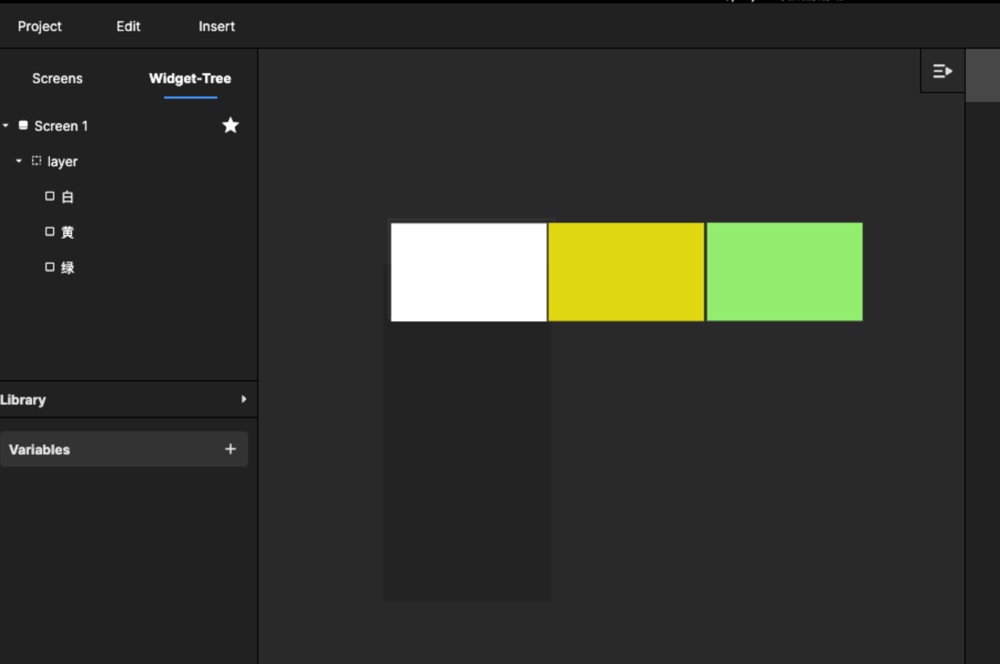
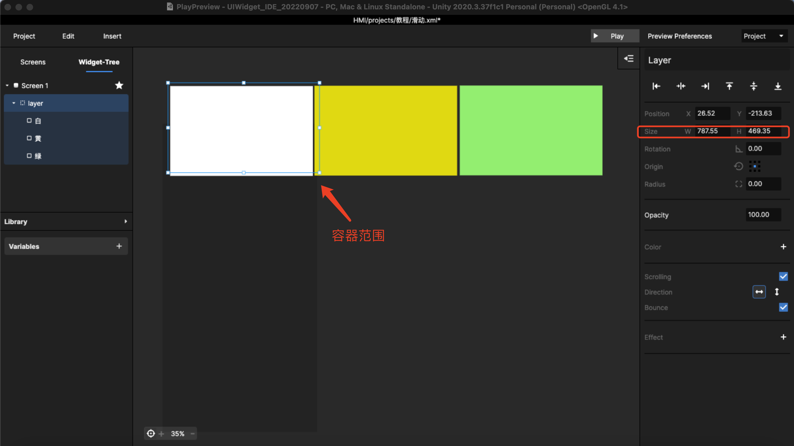
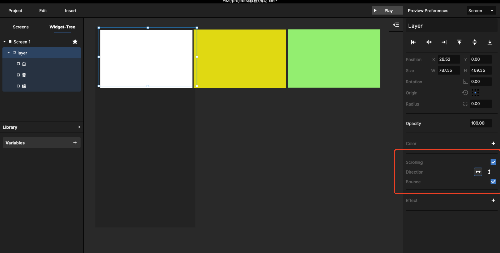
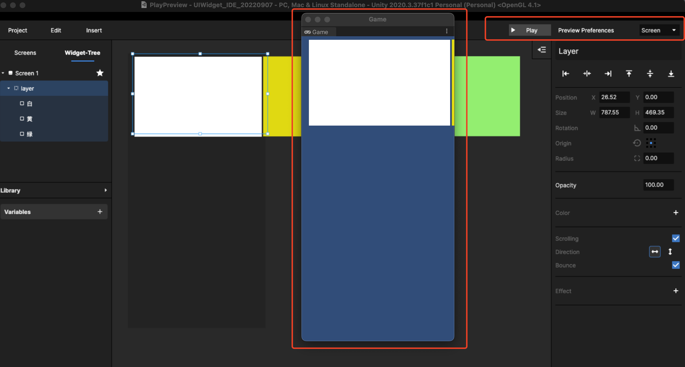

# 2. Layer 滚页/滑页使用案例

## Step 1

Insert 一些需要滚动或滑动的素材，如下图所示：

<figure><figcaption></figcaption></figure>

把他们组合group起来，或者重新 insert一个 layer，把他们放进 layer 中。

## Step 2

编辑滚动的区域，即 layer 的容器的范围，但子元件可以超过 Layer 的范围。

换一句话说，把 Layer 当做容器，在滚动时在 Layer设置的尺寸范围内滚动。&#x20;

<figure><figcaption>
当前 3个方块其实仅在这个容器范围内显示
</figcaption></figure>

## Step 3

勾选 Scrolling 的功能，并设置滚页滚动的方向，并且可以勾选设置，滚动超出 Layer 范围时的效果。

<figure><figcaption>
选中 layer 右侧设置
</figcaption></figure>

Bounce是回弹动效，可以让滑动更加顺滑。

## Step 4

保存当前 Project ，可以通过 Play 当前 Screen 可预览效果。

<figure><figcaption>
在预览窗里模拟滑动
</figcaption></figure>

上述步骤可以参考如下视频：



