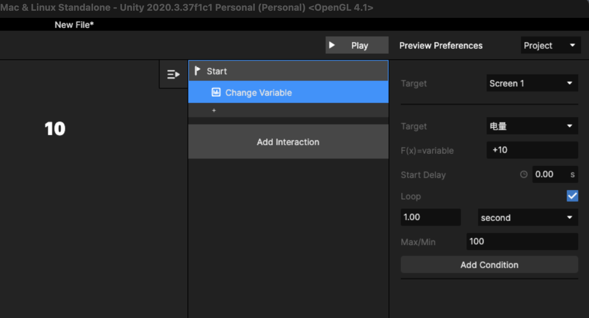

# 3. 变量使用案例

## Step 1

新增一个[ Variable](../bian-liang-yu-biao-da-shi/1.-bian-liang.md) ，如果是电量指示，可以如下图所示：

.png>)

## Step 2

Insert 一个Text类型的元件图层，在设置样式时，同时勾选 Variable，并选中上述设置的 Variable，可以参考下图所示：&#x20;

## Step 3

假设当前 Screen 是显示会变化的数值，则为Screen 增加 Trigger 和 Action，如下图所示：

<figure><figcaption></figcaption></figure>

上图即表示，每1秒当前变量由初始值+10，且循环增加，最大加到100，\
若不勾选 Loop，则F(x)的改变只执行1次，\
也支持修改 Loop 循环的间隔时间。

## Step 4

保存当前 Project ，可以通过 Play 当前Screen查看。



