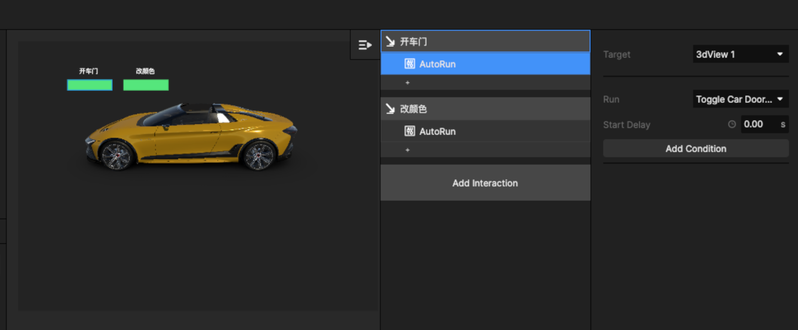

# 4. 3D 模型使用案例（定制功能）

## Step 1 拖入带 Event 事件的 3D 模型

在model画板中拖进一个车模的 3D 元件图层，此元件包含了预设的可交互的 event事件。

<figure><figcaption></figcaption></figure>

这些 3D 交互事件是需要unity定制的。

<figure><figcaption></figcaption></figure>

## Step 2 设置交互让车辆可以执行Event

设置交互元素，如 insert 一个button ，然后再对应设置交互

<figure><figcaption>
设置开车门交互
</figcaption></figure>

<figure><figcaption>
设置改颜色交互
</figcaption></figure>

## Step 3 预览交互效果

保存当前 Project ，可以通过预览窗看效果。

<figure><figcaption>
预览窗
</figcaption></figure>

上述步骤可以参考如下视频：



